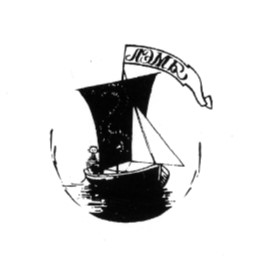
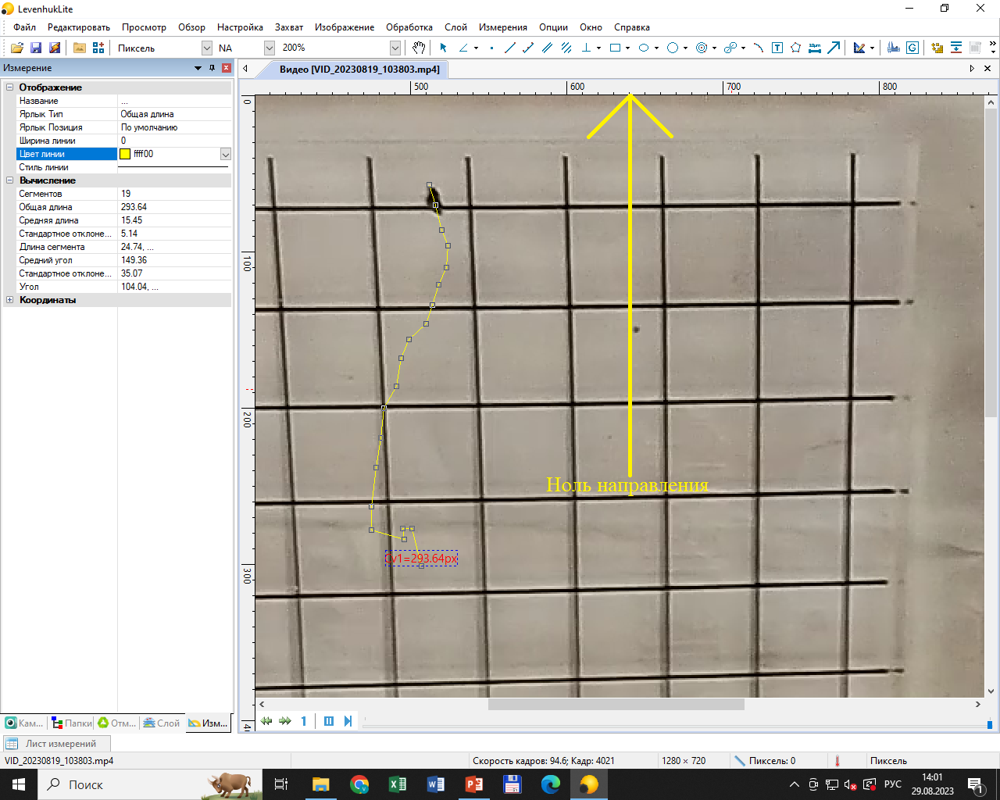

<<<<<<< Updated upstream
---
title: ''
output:
  word_document:
    reference_docx: style_for_RMD.docx
bibliography: bibliography.bib
csl: "marine-ecology-progress-series.csl"
---

```{r setup, include=FALSE}
library(knitr)
opts_chunk$set(echo = FALSE, warning = FALSE, message = FALSE)

options(knitr.kable.NA = '')
```

```{r packages}
library(readxl)
library(ggplot2)
library(dplyr)
library(broom)
library(clipr)
library(bibtex)
```

```{r read_data}

snail_move2 <- read_excel("Data/snail_movement_2023_lenght.xlsx", na = "NA")

snail_move2$Trait <- factor(snail_move2$Trait)

snail_move2$Trait <- relevel(snail_move2$Trait, ref = "Speed")

snail_move <- read_excel("Data/snail_movement_2023.xlsx", na = "NA")

Litt2 <- snail_move2 %>% filter(Species == "Littorina") 

Hydr2 <- snail_move2 %>% filter(Species == "Hydrobia")

Barbar <- snail_move %>% filter(Barbarity == "Barbar")

Litt <- snail_move %>% filter(Species == "Littorina")

Hydr <- snail_move %>% filter(Species == "Hydrobia")

```

# Эколого-биологический центр “Крестовский остров”

# Лаборатория Экологии Морского Бентоса

# (гидробиологии)

&nbsp;

&nbsp;




&nbsp;

# А. Бритиков

# Влияние мидий на двигателльные способности литторальных брюхоногих моллюсков

&nbsp; 

&nbsp; 

# Санкт-Петербург    
# 2023

\newpage

###### В работе анализировались влияние мидий на двигательную активность литоральных брюхоногих моллюсков за счет прикрепления к ним биссусных нитей. Были поставлены следующие вопросы: 1. влияет ли прикрепление биссусных нитей на скорость передвижения у гидробий и литторин? 2. влияет ли прикрепление биссусных нитей на вариабельность продвижения у этих двух видов? 3. влияет ли прикрепление биссусных нитей на время подготовки к движению моллюсков? Было показано, что у литторин, подвергшиеся прикреплению биссусом уходило больше времени, чтобы начать движение, их скорость была значимо ниже, а движение более направленно, чем у свободных. У гидробий значимых связей статуса со скоростью передвижения, с вариабельностью продвижения и с временем подготовки к движению не было выявлено.

# Введение

Мидиевые скопление соединенных между собой биссусными нитями, так же известным как друзы, являются консорцием с ярко выраженными топическими связями [@varigin2018]. Топические связи характеризуются тем, что один организм-детерминант изменяет внешнюю среду в худшую или в лучшую сторону для другого организма-консортанта [@beklemish1951]. Консортантами в этих связях, могут выступать различные беспозвоночные организмы такие как полихеты трубкостроители, ракообразные, олигохеты [@khaitov2007;@tsuchiya1986;@dittmann1990]. Консортантов в подобных связях может привлекать предоставляемые им детерминаторами убежище от своих естественных врагов, создаваемый субстрат и пища. [@kosobok2016;@turmuha2011]. Мидии являясь активными биоседиментаторами [@tsuchiya1986] способствуют накоплению в друзах осадка, который может привлекать консортантов.

Одними из наиболее многочисленных форм, населяющих скопления мидий, оказываются брюхоногие моллюски (представители семейства *Littorinidae*  и *Hydrobiidae*). В работе @khaitov2004 было показано, что в мидиевых друзах количество мертвых улиток значительно превышает их обилие за пределами скопления мидий. Авторы предположили, что моллюски, привлеченные обилием детрита, попав в друзу испытывают на себе негативное воздействие из-за чего умирают и их раковины накапливаются в друзах. Однако прямых доказательств в пользу этой гипотезы  не было найдено. В работе @kiril2016 изучался выбор субстрата брюхоногими моллюсками *Littorina* и *Hydrobia*. В этой работе было показано, что гидробии больше тяготеют к мидиям, как к биологически активному субстрату, в то время как литторин привлекала твердая поверхность, как таковая (раковины мертвых мидий), при этом улитки избегли  скоплений живых мидий. 

По сути дела, изучая влияние мидий на улиток, мы проводим анализ воздействия экологического фактора, имеющего биотическую природу [@vasiliev2003;@brod2007]. Общая схема воздействия экологического фактора подразумевает наличие диапазонов оптимума, пессимума и летали [@chernova2020;@brod2007]. Оптимальными являются те значения факторов, при которых возможно размножение организмов, в диапазон пессимума попадают те значения, при которых организм может существовать, но его репродукция подавлена и, наконец, летальные значения фактора подразумевают гибель организма [@throlova2010;@brod2007]. В проведенных ранее исследованиях [@khaitov2004;@kiril2016] о положительном или отрицательном влиянии мидий на улиток судили по показателям обилия гастропод в друзах или за их пределами. Вместе с тем, более надежным показателем уровня благосостояния организма, находящегося под влиянием экологического фактора, являются те характеристики, которые могут быть скоррелированными с репродуктивной активностью животного, к числу которых относятся многие физиологические характеристики [@kappes2012]. Так, например, в работе А. Бритикова [@britikov2022] было показано, что литторины, плененные биссусом мидий, выделяли значимо меньше пеллет, чем свободные. У свободных литторин число выделяемых пеллет возрастало с увеличением размера моллюска, в то время как у плененных число пеллет не зависело от размера моллюска. В отличи от литторин, плененные гидробии большого размера выделяли столько же пеллет сколько и свободные, а плененные гидробии небольшого размера выделяли даже больше пеллет, чем свободные того же размера. В работе этого года мы решили изучить влияние мидий на гастропод менее косвенно, так как изменение двигательной активности влечет за собой изменение питания и репродукции животного. Целью моей работы было узнать, как биссусное прикрепление влияет на двигательные способности литторин и гидробий.

# Материал и методика

## Сбор материалов
Работа проводилась на территории Кандалакшского заповедника на острове Ряжков. Непосредственный сбор материалов происходил на илисто-песчаной литорали Южной губы (координаты точки сбора 67.008560 N, 32.571260 E).

По малой воде, мы собирали мидиевые друзы, после чего помещали их в отдельный контейнер, не содержащий воды. Помимо сбора друз в этой же точке мы собирали живых улиток, представителей двух семейств *Littorinidae* и *Hydrobiidae*. Улитки из первого семейства были представлены только  *Littorina saxatilis* (далее этих моллюсков будем обозначать термином "литторины"). Согласно исследованиям, @gafarova2019, в месте сбора материала могут встречаться два вида, представителей второго семейства: *Peringia ulvae* и *Ecrobia ventrosa*. Поскольку идентификация этих видов без нарушения жизнедеятельности моллюсков невозможна, то мы не различали эти виды, а обозначали всех использованных в экспериментах улиток из этого семейства, как "гидробии".

Гидробий мы собирали, промывая песок через сито с размером ячеи 0.5 мм и помещая их в отдельный контейнер без воды. Литторин мы собирали с поверхности грунта после чего так же помещали их в сухой контейнер. Отсутствие воды в контейнерах, использованных для транспортировки собранных животных было необходимо, чтобы избежать преждевременного начала движения улиток. Контейнеры перемещали в лабораторию. Улитки до начала экспериментов содержались не более 8 часов.

## Проведение эксперимента
В лаборатории мы доставали из контейнеров с друзами литторин и гидробий подвергшиеся биссусному прикреплению (далее мы будем называть их “Плененными”), из контейнеров без друз мы доставали улиток, не подвергшиеся биссусному прикреплению (далее “Свободные”). 

Для тестирования перемещения улиток мы использовали пластину из оргстекла с нанесенной на ней сеткой (Рис. 1). Эту пластину помещали на дно контейнера с морской водой так, чтобы она располагалась в поле камеры смартфона, расположенного на высоте 35 см от дна контейнера. Мы не использовали никаких источников освещения, кроме естественного дневного света, который всегда падал с одной и той же стороны.

Отловленных улиток, по одной, выбранной случайным образом, мы сажали в центр пластины, после чего мы запускали секундомер. Если улитка не начинала двигаться спустя 5 минут (300 секунд) мы останавливали наблюдение. Если улитка начинала двигаться, то мы фиксировали время начала движения (T) и сразу запускали запись видеофрагмента на смартфоне. Если истекало 2 минуты (120 секунд) с момента начала записи видео или моллюск выползал за границы пластины, мы останавливали запись. Всего было обработано 302 улитки, для которых было сделано 245 видео записей.


Полученные видеозаписи далее обрабатывались в программе LevenhukLite (x64,4.8.16143.20191216). В программе мы запускали просмотр видео записи и, следуя за головным концом улитки, ставили точки в тех местах, где улитка меняла направление своего движения. Эти точки, будучи соединенными отрезками формировали трек перемещения животного (рис. 2). 



Программа LevenhukLite позволяет оценить следующие параметры трека: общая длина (L) и варьирование направления (SD), выраженное, как среднеквадратичное отклонение углов направления движения относительно стандартного направления (за ноль принималось направление от наблюдателя, снизу-вверх в видеозаписи, рис. 2). Полученное значение L мы делили на общую продолжительность времени движения улитки, что давало оценку скорости движения (Speed).

## Статистическая обработка
В качестве зависимой переменной в статистическом анализе мы использовали вариабельность направления (SD), скорость движения (Speed) и время подготовки к движению (T). Для каждой из этих переменных были построены линейные модели, отражающие связь с двумя предикторами ("Статус моллюска" и "Размер устья") и их взаимодействием. На основе  дисперсионного анализа полученных моделей принималось решение о статистической значимости влияния того или иного фактора. В качестве порогового значения для отвержения нулевой гипотезы использовался уровень значимости $\alpha$=0,05. Все расчеты проводились с использованием функций языка статистического программирования R 4.2.2 (R Core Team, 2022). 

# Результаты

## Движение гидробий
Рисунок 3 демонстрирует связь значения вариабельности направления движения (SD), скорости движения (Speed) и времени подготовки к движению (T) у двух групп гидробий. 
Единственным параметром, демонстрирующем различия в медианах измеренных величин (Рис. 3) было варьирование направления движения (SD). У свободных улиток дисперсия направления была ниже, то есть эти улитки двигались более прямолинейно. У плененных моллюсков изменчивость была выше, что свидетельствует о более извилистой траектории их движения. Однако дисперсионный анализ (табл. 1) не выявил значимой связи этого параметра ни с фактором  "Размер", ни  с фактором "Статус", ни с их взаимодействием. 

```{r fig.cap="Рисунок 3. Значения вариабельности направления, скорости движения и времени подготовки к движению у свободных и плененных гидробий."}

ggplot(Hydr2, aes(y = Value, x = Status,  fill = Status)) + 
  geom_boxplot() + 
  theme_bw() + 
  facet_wrap(~Trait,scales = "free_y") +
  labs(x = "Статус", y = "Значение параметра") + 
  guides(fill = "none")

```

Остальные изученные характеристики подвижности гидробий также  не демонстрировали связи с изученными факторами. Исключение составляет скорость движения, которая  демонстрировала статистически значимую, но очень слабую положительную зависимость от размера моллюска (Табл. 2, 3).

Рисунок 4 демонстрирует зависимость скорости передвижения (Speed) от размера устья гидробии и от ее статуса. Значение скорости незначительно увеличивалось с увеличением размера моллюска.

```{r fig.cap="Рисунок 4. Зависимость скорости передвижения от размера и статуса моллюска у гидробий"}
ggplot(Hydr, aes(y = Speed, x = Aperture_size, color = Status)) + 
  geom_point() +
  geom_smooth(method = 'lm') +
  theme_bw() + 
  guides(color = "none") +
  labs(x = "Размер устья", y = "Скорость передвижения") +
  facet_wrap(~Status)
```

```{r}
model_Hydr2_sp <-
Barbar %>% filter(Species == "Hydrobia") %>% 
  aov(Speed ~ Aperture_size * Status, data = .)
  
 

sp_df_h <- tidy(model_Hydr2_sp)

sp_df_h[, 1] = c("Размер устья", "Статус", "Размер устья : Статус", "Остатки")


kable(sp_df_h, caption = "Табл. 1. Результаты дисперсионного анализа модели, описывающей связь скорости движения с размером и статусом гидробий.", digits = 3, col.names = c("Источник варьирования", "Число степеней свободы", "SS", "MS", "F", "p"))
```

```{r}
model_Hydr2_sd <-
Barbar %>% filter(Species == "Hydrobia") %>% 
  aov(Sd ~ Aperture_size * Status, data = .)
  
 

sd_df_h <- tidy(model_Hydr2_sd)

sd_df_h[, 1] = c("Размер устья", "Статус", "Размер устья : Статус", "Остатки")

kable(sd_df_h, caption = "Табл. 2. Результаты дисперсионного анализа модели, описывающей связь вариабельности направления движения с размером и статусом гидробий.", digits = 3, col.names = c("Источник варьирования", "Число степеней свободы", "SS", "MS", "F", "p"))

```

```{r}
model_Hydr2_Tt <-
Barbar %>% filter(Species == "Hydrobia") %>% 
  aov(Turn_time ~ Aperture_size * Status, data = .)
  
 

Tt_df_h <- tidy(model_Hydr2_Tt)

Tt_df_h[, 1] = c("Размер устья", "Статус", "Размер устья : Статус", "Остатки")

kable(Tt_df_h, caption = "Табл. 3. Результаты дисперсионного анализа модели, описывающей связь времени подготовки к движению с размером и статусом гидробий.", digits = 3, col.names = c("Источник варьирования", "Число степеней свободы", "SS", "MS", "F", "p"))
```

## Движение литторин

Рисунок 5 демонстрирует зависимость вариабельности направления движения (SD), скорости движения (Speed) и времени подготовки к движению (T) от статуса литторин. Видно, что медианы всех изученных показателей различаются в двух группах. 

```{r fig.cap="Рисунок 5. Значения вариабельности направления, скорости движения и времени подготовки к движению у свободных и плененных литторин."}

ggplot(Litt2, aes(y = Value, x = Status,  fill = Status)) + 
  geom_boxplot() + 
  theme_bw() + 
  facet_wrap(~Trait,scales = "free_y") +
  labs(x = "Статус", y = "Значение параметра") + 
  guides(fill = "none")
```

Свободные литторины обладали более высокой скоростью (Speed, Рис. 5), чем плененные, то есть за одно и тоже время улитки, которые не подверглись биссусному прикреплению, могли пройти большее расстояние, чем те что подверглись воздействию биссуса. Однако дисперсионным анализом было выявлено значимое взаимодействие  факторов "Размер устья" и "Статус" (Табл. 4, Рис. 5). В связи с этим мы проанализировали зависимость скорости передвижения от размера устья литторины для двух групп (Рис. 6). Видно, что значение скорости у свободных литторин увеличивается прямо пропорционально размеру, в то время как у плененных литторин значение скорости от размера не демонстрирует зависимости. 

```{r fig.cap="Рисунок 6. Зависимость скорости передвижения от размера и статуса моллюска у литторин"}

ggplot(Barbar, aes(x = Aperture_size, y = Speed, color = Status)) + 
  geom_point() + 
  geom_smooth(method = 'lm') + 
  theme_bw() +
  xlim(0, 7) + 
  guides(color = "none") +
  labs(x = "Размер устья", y = "Скорость передвижения") +
  facet_wrap(~Status)
  

```

```{r}
model_Litt2_Speed <-
Litt %>% aov (Speed ~ Aperture_size * Status, data = .)
  
sp_df_l <- tidy(model_Litt2_Speed)

sp_df_l[, 1] = c("Размер устья", "Статус", "Размер устья : Статус", "Остатки")

kable(sp_df_l, caption = "Табл. 4. Результаты дисперсионного анализа модели, описывающей связь скорости движения с размером и статусом литторин.", digits = 3, col.names = c("Источник варьирования", "Число степеней свободы", "SS", "MS", "F", "p"))
```

Вариабельность направления движения (SD, Рис. 5) у плененных литторин была статистически значимо ниже, чем у свободных (Табл. 5). Значимого влияния размера устья и взаимодействия факторов не выявлено (Табл. 6).

Дисперсионный анализ не выявил влияния размера устья и взаимодействия факторов на  время начала движения (Табл. 6). Однако влияние фактора "Статус" было статистически значимым. Таким образом, можно утверждать, что  у плененных моллюсков промежуток времени между размещением улитки на пластине и началом движения был значимо выше, чем у свободных  (Рис. 5).

```{r}
model_Litt2_Sd <-
Barbar %>% filter(Species == "Littorina") %>% 
  aov(Sd ~ Aperture_size * Status, data = .)

sd_df_l <- tidy(model_Litt2_Sd)

sd_df_l[, 1] = c("Размер устья", "Статус", "Размер устья : Статус", "Остатки")

kable(sd_df_l, caption = "Табл. 5. Результаты дисперсионного анализа модели, описывающей связь вариабельности движения с размером и статусом литторин.", digits = 3, col.names = c("Источник варьирования", "Число степеней свободы", "SS", "MS", "F", "p"))
```

```{r}
model_Litt2_Tt <-
Barbar %>% filter(Species == "Littorina") %>% 
  aov(Turn_time ~ Aperture_size * Status, data = .)
  
Tt_df_l <- tidy(model_Litt2_Tt)

Tt_df_l[, 1] = c("Размер устья", "Статус", "Размер устья : Статус", "Остатки")

kable(Tt_df_l, caption = "Табл. 6. Результаты дисперсионного анализа модели, описывающей связь времени начала движения с размером и статусом литторин.", digits = 3, col.names = c("Источник варьирования", "Число степеней свободы", "SS", "MS", "F", "p"))
```

# Обсуждение
Полученные нами результаты показывают, что по анализируемым нами параметрам свободные гидробии мало отличаются от плененных. Дисперсионный анализ не выявил значимых различий между группами. Это означает, что биссусное прикрепление не влияет на двигательные способности гидробий. Единственная статистически значимая закономерность - это слабая положительная связь скорости движения с размером устья. Однако эта связь лежит за пределами задач данной работы. 

Иная картина была выявлена для литторин. По всем трем анализируемым параметрам эти улитки имели значимую связь со статусом моллюска. Плененные литторины двигались менее прямолинейно, медленнее, а также у них уходит больше времени, для того чтобы начать движение, по сравнению со свободными литторинами. Таким образом, литторины, которые подверглись биссусному прикреплению испытывали на себе негативное воздействие. 

Эти результаты хорошо соотносятся с результатами предыдущих исследований, в которых регистрировали количество выделяемых плененными и свободными моллюсками пеллет фекалий [@britikov2022]. Было показано, что гидробии так же не испытывали значимого воздействия со стороны мидий. У литторин, как и в нашем исследовании, наблюдалось снижение уровня физиологической активности [@britikov2022]. 

Различия в скорости продвижения и времени начала движения у литторин и отсутствие различий у гидробий, можно объяснить разным способом питания моллюсков. Способ питания литторин - соскабливая радулой микрообрастания с поверхности твердых субстратов [@otero1997]. Гидробии же  могут собирать осадок с поверхности грунта [@lopez1978]. Плененная литторина может собирать микрообрастания лишь с небольшой территории ограниченной длинной биссусной нити. В случае с гидробиями, прикрепление биссусных нитей не так критично, так как они могут питаться частицами осадка [@lopez1978].

Передвижение брюхоногих моллюсков по субстрату крайне энергозатратное действие [@houlihan1982], поэтому можно предположить, что скорость движения и время начала движения напрямую зависят от степени насыщенности животного [@calow1974]. У голодных моллюсков ожидается снижение скорости и увеличение времени начала движения. Иное дело направление движения. Степень прямолинейности перемещения трудно связать с обилием пищи. При этом плененные литторины демонстрировали более прямолинейное движение, чем свободные. Наблюдаемому явлению мы можем дать два объяснения. Во-первых, для литторин известно явление хоминга [@newell1958]: улитки возвращаются на то место, откуда они уползли во время питания. Хоминг подразумевает большую вариацию углов перемещения. Если улитка уползает от места своей дислокации, но не стремится вернуться туда, то, ожидаемо, вариация углов должна быть ниже. Поскольку пленение литторин в друзах, скорее всего, является вредным, то возвращение в данное место кажется невыгодным. 

Во-вторых, другой причиной, почему удалось выявить различия в вариабельности продвижения у двух групп литторин, может быть стрессирование плененных литторин мидиями. В работе Петрэитиса [@petraitis1982] говорится, что литторины, не подвергшиеся воздействию, двигались в случайном направление в отличие от тех, что подверглись, которые двигались более направленно. 

# Заключение

Таким образом, можно сказать, что биссусное прикрепление не влияет на двигательные способности гидробий. Литторины, подвергшиеся прикреплению, испытывают на себе негативное воздействие из - за чего скорость передвижения у плененных была ниже, чем у свободных, а время подготовки к движению было больше у плененных. Так же было выявлено, что плененные литторины имели меньшую вариабельность углов продвижения, чем свободные. 

# Благодарности

Я хотел бы поблагодарить участников Беломорской экспедиции за помощь в
подготовке и постановке полевого эксперимента, сотрудников Кандалакшского
Государственного Природного заповедника за предоставление возможности сбора материала
для написания данной исследовательской работы и моего научного руководителя Вадима
Михайловича Хайтова, без участия которого не был бы поставлен эксперимент и написана
данная работа.

# Список литературы
=======
>>>>>>> Stashed changes
