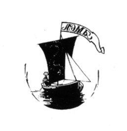
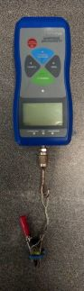

```{r setup, include=FALSE}
library(knitr)
opts_chunk$set(echo = FALSE)
```


## Эколого-биологический центр “Крестовский остров”

## Лаборатория Экологии Морского Бентоса

## (гидробиологии)

\newline

\newline

\newline

\newline


```{r fig.align='center'}



```


&nbsp; &nbsp; &nbsp; &nbsp;

&nbsp; &nbsp; &nbsp; &nbsp;

&nbsp; &nbsp; &nbsp; &nbsp;

# Т. Ершова  

&nbsp; &nbsp; &nbsp; &nbsp;

&nbsp; &nbsp; &nbsp; &nbsp;

&nbsp; &nbsp; &nbsp; &nbsp;

## Санкт-Петербург    
## 2022

\pagebreak

##### *Mytilus spp.*, прикрепленные к фукоидам, получают ряд преимуществ,при этом излишняя масса моллюсков снижает плавучесть фукоида. Боротся с обрастанием он может с помощью выделений, влияющих на силу прикрепления или активность выделения биссуса. Было поставлено два эксмеримента для оценки воздействия на количество биссуса и прочность прикрепления к субстрату. Под воздействием *Fucus vesiculosus* морфотипы уменьшали количество биссуса. Сила прикрепления значимо не различалась, но мидии T-морфотипа под влиянием *Fucus vesiculosus* прикреплялись сильнее, чем мидии Е-морфотипа.

# Введение
Среди многочисленных симфизиологических связей (Беклемишев, 1970) прямые топические взаимодействия играют наиболее важную роль. При таких взаимодействиях один из организмов создает благоприятные условия для жизни другого. В частности тела организмов одно вида могу служить субстратом для прикрепления органимов другого вида.  К числу таких взаимодействий относятся, например, гнездование птиц в дуплах в стволах деревьев (Прокофьева, 2004), обитание животных в деревьях (Дайнеко, Жадько, 2016), взаимоотношения трематод и моллюсков (Минеева, 2020) поселение обрастателей на створках моллюсков (Varigin, 2018).

В условиях морской литорали прямые топические связи ярко выражены в случае  взаимоотношения мидий *Mytilus spp*. с бурыми водорослями *Ascophyllum nodosum* и *Fucus vesiculosus* (Човган, Малавенда, 2017). Моллюски, прикреплясь к таломам водорослей своими биссусными нитями получают целый ряд преимуществ: недоступность для хищников, лучшую аэрацию воды. Однако для самих фукоидов обрастатели приносят, скорее, вред. Так, мидии увеличивают вес водорослей, чем снижают их плавучесть и на прижатых фукоидах образуется мидиевая щетка, что в конечном счете приводит к гибели растения (Лавренова, 1996). Известно, что некоторые водоросли, например *Ochrophyta*, борются с обрастанием мидиями с помощью выделения различных метаболитов (da Gama at all, 2014), которые мешают прикрепляться моллюскам. 


Мидии прикрепляются к субстрату при помощи биссуса. Поэтому метаболиты, направленные против обрастания, скорее всего будет влиять на интенсивность его выделения или прочность прикрепления к субстрату. Тем более, биссус обладает высокой чувствительностью к разным биотическим факторам. Так, в присутсвии сигналов от хищников или конкурентов мидии могут выделять больше биссуса, который служит для защиты от воздействий  (Lowen at all, 2013; Шеламова, 2022). 

Роль фукоидов, как субстрата, была выявлена и в другом аспекте. Было показано, что два вида мидий, обитающих в Белом море (*M. trossulus* и *M. edulis*), демонстрируют разный характер связи с водорослями. Относительное обилие первого вида на фукоидах оказывается выше, чем на грунте (Katolikova at all, 2016). Эта асиммтерия позволяет ожидать, что если фукоиды оказывают воздействие на мидий, то возможно, что  *M. edulis* более подвержены влиянию метаболитов водорослей, чем *M. trossulus*.

Мы предположили, что при воздействии веществ, выделяемых фукоидами, сила прикрепления и количество биссусных нитей будет снижаться. При этом мы ожидаем, что у *Mytilus trossulus* реакция будет менее выражена, чем у *M.edulis*. 

# Материалы и методы

## Идентификация видовой принадлежности мидий

В этой работе мы применяли разделение мидий на морфотипы по полосе конхеалинового слоя рядом с лигаментом. По этому признаку мидии были разделены на две группы: Т-морфотип (соответствует *M. trossulus*) и Е-морфотип (соответствует *M. edulis*) (Khaitov et al. 2021). Мидии Е-морфотипа обладали перламутровым слоем, плотно прилегающем к лигаменту, в то время как у Т-морфотипа лигамент отделялся от перламутрового слоя конхеалиновым (рис. 1). 


```{r, echo=FALSE, warning=FALSE, message=FALSE}
library(readxl)
library(ggplot2)
library(broom)
library(knitr)
library(dplyr)
```


```{r, echo=FALSE, message=FALSE, warning=FALSE}
bys <- read_excel('Data/FucBys_2023.xlsx', na = "NA", sheet = "Experiment FucBys")
bys$Treatment <- factor(bys$Treatment)
bys$Treatment <- relevel(bys$Treatment, ref = 'Control')
labe = c('Ascophyllum', 'Контроль', 'Fucus')

frc <- read_excel('Data/FucBys_2023.xlsx', na = "NA", sheet = "Fuc_Tred_Force")
frc$True_Force <- frc$Force - frc$Weight / 1000 * 9.81
frc$True_Force[(!is.na(frc$True_Force)) & frc$True_Force < 0] <- 0


```


## Полевые сборы
Для обоих экспериментов использовались мидии, собранные на острове Большой Ломнишний (66,98N 32.62E) и с плавучего причала на о. Ряжкове (67.007642N, 32.575518E). Выбор точек сбора материала был обусловлен отсутствием *Ascophyllum nodosum* и *Fucus vesiculosus* в непосредственной близости от поселения мидий для исключения контакта с Фукоидами. В первой точке преобладали особи E-морфотипа, во второй было больше мидий T-морфотипа.  Мидий калибровали, отбирая моллюсков размером 10-15 мм. До начала эксперимента мидии находились в садках, свешенных с причала, в течение 1 дня.

На литорали Южной губы острова Ряжков для дальнейших экспериментов были собраны *Ascophyllum nodosum* и *Fucus vesiculosus* и очищены от обрастателей. 

## Эксперимент 1. Влияние выделений на количество биссусных бляшек

### Подготовка

Для подготовки воды брали 6 контейнеров размером 70х50х40 см. В два контейнера помещали пучки *Ascophyllum nodosum* массой 185 грамм, в два *Fucus vesiculosus* такой же массы и заливали 0,5 литрами морской воды. Оставшиеся 2 наполнили только 0,5 морской воды. Выбор указанного количества воды был обусловлен следующим предположением: во время отлива вокруг фукуса остается небольшой объем воды, в котором концентрация веществ, выделяемых фукусом, будет близка к получаемой при указанном объеме. Спустя сутки фукоиды были извлечены. Эту воду в дальнейшем мы будем обозначать,как «кондиционированную» воду. 

Также были подготовлены 120 бакпечаток (диаметр 38 мм, высота 37 мм), которые разделили на 3 группы (*Ascophyllum*, *Fucus* и контроль) с 2 повторностями (табл. 1). В бакпечатки каждой группы клали мидий определенного морфотипа (половина от группы) и заполняли емкость стандартным кондиционированной количеством воды в зависимости от группы.

Табл. 1.Группы бакпечаток

|Группа	|Описание	|Количество бакпечаток	|Количество бакпечаток с T-морфотипом	|Количество бакпечаток с E-морфотипом|
|--------|----------|----------|----------|----------|----------|
|Ascophyllum	|Вода, кондиционированная Ascophyllum nodosum	|20	|10	|10|
|Fucus	|Вода, кондиционированная Fucus vesiculosus	|20	|10	|10|
Контроль|	Не кондиционированная вода|	20|	10|	10|

### Снятие и обработка

Эксперимент продолжался в течение 3 суток, после чего моллюсков извлекали из бакпечаток. Внутреннюю поверхность бакпечатки окрашивали спиртовым раствором йода и просматривали в проходящем свете под бинокуляром, подсчитывая биссусные бляшки (следы прикрепления биссуса).

## Эксперимент 2. Влияние выделений на силу прикрепления мидий

### Подготовка эксперимента

Для анализа силы прикрепления мидий использовали стандартные керамические пластины (размер 20 см х 20 см). На пластинах размещали пластиковую решетку, которая разделяла пластину на 25 камер. В каждую из камер помещали мидий: в четные ячейки T-морфотип, в нечетные Е-морфотип. Сверху пластина была обтянута делью с размером ячеи 4 мм, которая не прижимала мидий, но предотвращала перемещение моллюсков из одной ячейки в другую. Всего было подготовлено 16 пластин.

Были подготовлены 16 садков, состоящих из двух контейнеров, соединенных эластичными стяжками. Их прикрепляли к двум утяжелителям по 8 штук (рис. 2 Г-Е). В каждый садок помещали пластину (рис. 2 А). К одной установке прикрепляли при помощи эластичных стяжек *Fucus vesiculosus*, а также помещали водоросли внутрь садка под пластину (рис. 2 Д).  Садки установили на линии уреза воды (рис. 2 Г).


### Снятие и обработка

Через 5 суток пластины извлекли из садков. Мы измеряли силу прикрепления и взвешивали мидий сразу после снятия пластин. Для измерения силы прикрепления был использован электронный динамометр Мегеон-23020. К датчику прибора был прикреплен зажим-крокодильчик (рис. 3), которым аккуратно зажимали раковину мидии. После этого динамометр оттягивали перпендикулярно плоскости прикрепления мидии и фиксировали максимальное показание динамометра в момент отрыва моллюска от субстрата. Измерения силы проводились с точностью до 0.001 Н. После отрыва измеряли массу моллюска (m) при помощи электронных весов с точностью до 0,001 г. Из анализа исключали мидий, прикреплённых к сетке или не образовавших биссуса. 
Для дальнейших вычислений из измеренной силы прикрепления вычитали вес моллюска. Скорректированная сила прикрепления была рассчитана по следующей формуле: $F прикрепления = F – mg$.  Всего была измерена сила прикрепления у 149 моллюсков T-морфотипа и 141 моллюска E-морфотипа. После измерений мидий очищали от мягких тканей и определяли морфотип.



## Статистическая обработка

Обработка производилась с помощью языка статистического программирования R (R Core Team, 2022). 

Для обработки первого эксперимента был проведен двухфакторный дисперсионный анализ. В  качестве зависимой переменной  выступало количество выделяемого моллюском биссуса, которое для дальнейшего анализа было подвергнуто логарифмированию.  В качестве первого фактора в этом анализе выступал тип кондиционированной воды. В качестве второго фактора выступал морфотип мидии. Кроме того учитывалось и взаимодействие факторов.  Для попарных сравнений средних использовали тест Тьюки.

Для обработки второго эксперимента также проводили двухфакторный дисперсионный анализ. В качестве зависимой переменной использовали логарифмированную силу прикрепления. В качестве первого фактора выступал тип садка (Садки с фукусами VS контроль), в качестве второго фактора морфотип мидии. Мы учитывали взаимодействие факторов. Для попарных сравнений использовали тест Тьюки.

# Результаты

## Количество биссуса

Под влиянием *Fucus vesiculosus* оба морфотипа значительно уменьшали количество биссуса по сравнению с контролем. Кондиционированная вода от  *Ascophyllum nodosum* практически не влияла на количество биссуных бляшек. В садках типа Ascophyllum и контроль Т-морфотип выделял больше биссуса, чем Е-морфотипа. Практически равное количество наблюдается в типе Fucus (рис. 4). 


```{r, echo=FALSE, message=FALSE, fig.cap= "Рисунок 4. Количество биссусных бляшек в бакпечатках с разной кондиционированной водой", warning=FALSE}
labe = c('Ascophyllum', 'Контроль', 'Fucus')
ggplot(bys, aes(x = Treatment, y = N_byss, fill = Morphotype)) + 
  geom_boxplot() +
  theme_bw()+
  labs(x = 'Тип', y = 'Количество биссуса', fill = 'Морфотип')+
  scale_x_discrete(label = labe)
```


Дисперсионный анализ показал значимое влияние типа воды и морфотипа мидии. Взаимодействие тоже было значимым, что указывает на различную реакции Т- и Е-морфотипа (табл. 2). Тест Тьюки выявил значимые отличия между контролем и влиянием *Fucus vesiculosus*.  Значимых отличий между Ascophyllum и контролем не выявлено. Различия между морфотипами оказались значимыми в типах Ascophyllum, контроль, под воздействием *Fucus vesiculosus* количество биссуса между морфотипами значимо не различалось (табл. 3).


```{r, echo=FALSE, message=FALSE, warning=FALSE}
mod <-lm(log(N_byss+1) ~ Treatment + Morphotype + Treatment:Morphotype, data = bys) 

anova_df <- tidy(anova(mod))

anova_df[,3:5] <- round(anova_df[,3:5], 3)
anova_df[,6] <- round(anova_df[,6], 4)

anova_df$symbol <- if(anova_df$p.value < 0.05){
  anova_df$symbol = '*'
}else{
    anova_df$symbol = 'NS'
    }

kable(anova_df,
      caption =  "Таблица 2. Дисперсионный анализ количества биссусных бляшек",
      col.names = c("Источник варьирования", "Df",	"SS",	"MS",	"F", "p", "")
      )


```


```{r, echo=FALSE, message=FALSE, warning=FALSE}
mod_anva <-aov(log(N_byss+1) ~ Treatment + Morphotype + Treatment:Morphotype, data = bys)

Tuk <- tidy(TukeyHSD(mod_anva))

Tuk <- Tuk %>% select(-null.value, -estimate, -conf.low, -conf.high)

Tuk$adj.p.value <- round(Tuk$adj.p.value, 4)

kable(Tuk,
      caption = "Табл. 3. Тест Тьюки. Попарное сравнение количества биссусных бляшек.",
      col.names = c('Источник варьирования', 'Сравнение', 'p'))


```

## Сила прикрепления

Значение силы прикрепления не изменялось под воздействием фукоидов (рис. 4). Дисперсионный анализ не показал значимого влияния *Fucus vesiculosus*. Влияние морфотипа было значимым. Взаимодействие факторов близко к пороговому значению (табл. 4). Тест Тьюки показал, что под влиянием *Fucus vesiculosus* сила прикрепления значимо отличалась между морфотипами - Т-морфотип прикреплялся сильнее.

```{r, echo=FALSE, fig.cap="Рис. 4. Силы прикрепления в разных типах установок.", message=FALSE, warning=FALSE}
labef = c('Контроль', 'Fucus')
ggplot(frc, aes(fill = Morphotype, y = log(True_Force +1), x = Type ))+
  geom_boxplot()+
  theme_bw()+
  labs(x = 'Тип', y = 'Логарифм силы прикрепления', fill = 'Морфотип')+
  scale_x_discrete(label = labef)
```


```{r, echo=FALSE, message=FALSE, warning=FALSE}
frc$True_Force[(!is.na(frc$True_Force)) & frc$True_Force < 0] <- 0


mod <- lm(log(True_Force + 1) ~ Type + Morphotype + Type:Morphotype , data = frc)

anova_df <- tidy(anova(mod))

anova_df[,3:5] <- round(anova_df[,3:5], 3)
anova_df[,6] <- round(anova_df[,6], 4)


kable(anova_df,
      caption =  "Таблица 4. Дисперсионный анализ силы прикрепления",
      col.names = c("Источник варьирования", "Df",	"SS",	"MS",	"F", "p")
      )

```

```{r, echo=FALSE, message=FALSE, warning=FALSE}
frc$True_Force[(!is.na(frc$True_Force)) & frc$True_Force < 0] <- 0


mod <- aov(log(True_Force + 1) ~ Type + Morphotype + Type:Morphotype , data = frc)

tuk <- tidy(TukeyHSD(mod))

tuk <- tuk %>% select(-null.value, -estimate, -conf.low, -conf.high)

tuk$adj.p.value <- round(tuk$adj.p.value, 4)

kable(Tuk,
      caption = "Тест Тьюки. Попарное сравнение силы прикрепления.",
      col.names = c('Источник варьирования', 'Сравнение', 'p'))
```

# Обсуждение результатов
В первом эксперименте мидии T-морфотипа, в среднем, вырабатывали больше бисуса. Этот результат хорошо согласуется с результатами предыдущих работ, в которых было показано, что мидии T-морфотипа продуцируют биссус в большем количестве, чем мидии Е-морфотипа как в контрольных условиях, так и под воздейстивем химических сигналов от хищников (Кириллов, 2018; Ершова 2022).

Под воздействием *Fucus vesiculosus* количество  биссуса значимо уменьшалось как у мидий Т-морфотипа, так и у мидий E-морфотипа. Значит, в кондиционированной воде содержались вещества, пряпятствующие прикреплению к поверхности или ингибирующие образование биссуса. При этом, поскольку во время подготовки кондиционированной воды  было использовано по два разных контейнера на каждый тип, мы можем быть уверенны, что наблюдаемый эффект не является следствием случайности, а является следствеим наличия некоторых воздействий, связанных с *Fucus vesiculosus*. Можно предположить, что эти водоросли выделяют какие-то вещества, воздействующие на взаимодействие мидий с этим биогенным субстратом.  При этом *Ascophyllum nodosum* не влиял на интенсивность выработки биссуса, то есть наблюдаемое различие нельзя связать и с тем, что в воде при ее подготовке присутсвовало большое количество фитомассы. В настоящий момент мы не знаем, почему два вида фукоидов демонстрируют столь сильные различия в степени влияния на мидий. Однако полученные результаты хорошо согласуются с данными предыдущих работ. Так, например, В. Широкова (1998) показала, что моллюски активнее прикрепляются к слоевищам *Ascophyllum nodosum*, чем к слоевищам *Fucus vesiculosus*.


Во втором эксперименте мы не наблюдали изменения силы прикрепления в садках с фукусами по сравнению с контролем. При этом, в контрольной группе садков сила прикрепления не отличалась между морфотипами. Вероятно, время эксперимента оказалось недостаточным. Однако в садках, которые находились под воздействием *Fucus vesiculosus* мидии Т-морфотипа прикреплялись значимо сильнее мидий Е-морфотипа, что говорит о большей чувствительности Е-морфотипа к воздействию со стороны фукоидов. Это согласуется с наблюдаемой закономерностью в распределении мидий разных морфотипов по субстратам: относительное обилие мидий Е-морфотипа выше на   грунте, чем на талломах фукоидов (Katolikova at all, 2016). 


# Благодарности
Хотелось бы выразить благодарность Вадиму Михайловичу Хайтову как научному руководителю, Кандалакшскому заповеднику за возможность работы и команде LVII Беломорской экспедиции за помощь в постановке эксперимента.

# Список литературы
Беклемишев, В. Н. (1970). Биоценологические основы сравнительной паразитологии.

Дайнеко, Н. М., & Жадько, С. В. (2016). Ботаника: геоботаника.

Ершова, Т. (2022). Защитные реакции беломорских *Mytilus edulis* и *M. trossulus* в ответ на сигналы от Asterias rubens. Работа депонирована в Лаборатории экологии морского бентоса (гидробиологии)


Кириллов, О. (2018). Реакция беломорских мидий на присутствие хищника (*Asterias rubens*). Работа депонирована в Лаборатории экологии морского бентоса (гидробиологии)

Лавренова, А. (1996). Поселение мидий на фукоидах Белого моря: описание разнообразия и особенностей их динамики. Работа депонирована в Лаборатории экологии морского бентоса (гидробиологии)

Минеева, О. В. (2020). Паразиты молоди щуки *Esox lucius Linnaeus, 1758* в Саратовском водохранилище.-Самарская Лука: проблемы региональной и глобальной экологии,-29(4), 62-63.

Прокофьева, И. В. (2004). Расположение гнёзд разных птиц на одних и тех же деревьях. Русский орнитологический журнал, 13(253), 170-173.

Човган, О. В., & Малавенда, С. С. (2017). Роль макрофитов как субстрата в формировании литоральных эпизооценозов Белого моря.-Вестник Мурманского государственного технического университета,-20(2), 390-400.

Шеламова, В. (2022). Механизм конкуренции мидий *Mytilus edulis Linnaeus, 1758* и *M. trossulus Gould, 1850*. Работа депонирована в 
Лаборатории экологии морского бентоса (гидробиологии)

Широкова, В. (1998). Анализ избирательности и активности прикрепления мидий к литоральным макрофитам (Кандалакшский залив Белого моря). Работа депонирована в Лаборатории экологии морского бентоса (гидробиологии)

Khaitov, V., Marchenko, J., Katolikova, M., Väinölä, R., Kingston, S. E., Carlon, D. B., Gantsevich, M., & Strelkov, P. (2021). Species identification based on a semi-diagnostic marker: Evaluation of a simple conchological test for distinguishing blue mussels *Mytilus edulis L.* and *M. trossulus Gould*. PLoS ONE, 16(July), 1–27. https://doi.org/10.1371/journal.pone.0249587

da Gama, B. A., Plouguerné, E., & Pereira, R. C. (2014). The antifouling defence mechanisms of marine macroalgae. In-Advances in botanical research-(Vol. 71, pp. 413-440). Academic Press.

Katolikova, M., Khaitov, V., Väinölä, R., Gantsevich, M., & Strelkov, P. (2016). Genetic, ecological and morphological distinctness of the blue mussels *Mytilus trossulus Gould* and *M. edulis L.* in the White Sea.-PLoS One,-11(4), e0152963.

Lowen, J. B., Innes, D. J., & Thompson, R. J. (2013). Predator-induced defenses differ between sympatric *Mytilus edulis* and *M. trossulus*. Marine Ecology Progress Series, 475, 135– 143. https://doi.org/10.3354/meps10106

Varigin, A. Y. (2018). Biotic links in the fouling community of Odessa Bay (Black Sea).-Biosystems Diversity,-26(1), 24-29.


