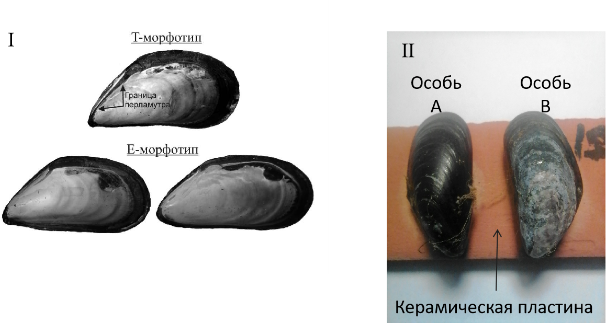

```{r setup, include=FALSE}
library(knitr)
library(ggplot2)
library(readxl)
library(dplyr)
library(cowplot)

opts_chunk$set(echo = FALSE, warning = FALSE, message = FALSE)
options(knitr.kable.NA = '')
```


## Эколого-биологический центр “Крестовский остров”

## Лаборатория Экологии Морского Бентоса

## (гидробиологии)

&nbsp;

&nbsp;


&nbsp;

# В. Шеламова 

###### Биссус, как средство подавления конкурнетов у беломорских мидий *Mytilus edulis* Linnaeus, 1758 и *M. trossulus* Gould, 18

&nbsp; 

&nbsp; 

&nbsp;

## Санкт-Петербург    
## 2023

\pagebreak


##### Исследование  посвящено анализу межвидовой конкуренции мидий *Mytilus trossulus* и *M. edulis* в условиях Белого моря. Было замечено, что в гетероспецифических парах мидии *M.trossulus* выделяют больше биссусных нитей, чем в гомоспецифических. У *M. edulis* нет различий в количестве биссуса в гомо- и гетороспецифических парах. На основе полученных данных мы можем предположить, что *M.trossulus* способны различать мидий вида *M. edulis* и реагировать на них увеличением количества выделяемого биссуса. Это можно интерпретиравать, как способ конкурентных взаимодействий или защиты от предполагаемого врага. Также было отмечено, что в парах, состоящих из мидий *M. trossulus*, чаще всего встречалось прикрепление биссуса, идущего к стволу биссусных нитей партнера ("взаимные" нити). Это может свидетельствовать о наличии внутривидовой конкуренции.

&nbsp;

## Введение

Одним из условий выживания моллюсков семейства Mytilidae в прибрежной зоне является их способность прикрепляться к субстрату посредством биссусных нитей [@lee1990rate]. Образование нити, имеющей неклеточное белковое строение [@waite1983adhesion; @waite1997marine], в биссусной бороздке ноги происходит по принципу отливки в фильерах [@vekhova2007; @vekhova2019; @vekhova2021byssal]. При этом аппарат, секретирующий биссусс, несмотря на сохранение единого плана организации, может иметь  некоторые особенности строения у разных видов этого семейства [@vekhova2007]. 

Известно, мидии могут использовать биссус в качестве оружия [@petraitis1987immobilization] для борьбы с конкурентами, облепляя поверхность их тел, препятствуя тем самым нормальному функционированию организма конкурента
[@khalaman2015clumping]. Негативное влияние биссуса было доказано в исследованиях В. М. Хайтова и А. В. Артемьевой [@khaitov2004] и А. Бритикова [@britikov_2022]. Было показано снижение жизнеспособности брюхоногих моллюсков  из-за прикрепления к ним биссусных нитей. Питер Петрайтис с соавторами [@petraitis1987immobilization] описал оборонительное поведение *M. edulis* в отношении хищных улиток *Nucella lapillus*. Успех *M. edulis* в обездвиживании *N. lapillus* позволяет предположить, что биссусные нити способны обеспечивать защиту от хищников. 

Криптические виды, которыми являются мидий *Mytilus edulis* Linnaeus, 1758 и *M. trossulus* A. Gould, 1850, имеют пересекающиеся ареалы обитания [@strelkov2012] и занимают сходные экологические ниши. В их случае принцип Гаузе проявляется в экологической диверсификации по разным экологическим нишам: *M.trossulus* чаще селятся на водорослях, а *M.edulis* предпочитают поверхность грунта [@katolikova2016genetic].  Одной из причин расхождения данных видов по микробиотопам может быть вытеснения более слабого конкурента в менее благоприятное местообитание. В последнем случае должны существовать механизмы конкуренции, которые пока не известны.

Изучению возможных механизмов конкуренции двух видов беломорских мидий была посвящена наша прошлая работа [@shelamova_2022]. Тогда были смоделированы условия, в которых  мидия имела возможность ощупывать  ногой поверхность раковины соседней мидии (но не могла при этом контактировать с мягкими тканями соседа) и приреплять биссусные нити либо к раковине соседа либо к неживому субстрату. Нами было показано, что *Mytilus edulis* и *M. trossulus* пользуются разными стратегиями распределения биссусных нитей. *M.edulis* с большей  вероятностью прикрепляются к особям другого вида, а *M. trossulus* наоборот стремятся прикрепиться к субстрату или к особи своего вида. Так как *M. edulis* и *M.trossulus* очень близкие виды и занимают сходные экологические ниши, можно ожидать, что моллюски могут вступать в
конкурентные отношения, используя биссус. В таком случае *M. edulis* имеют преимущество в конкуренции.

Отсутствие контакта с мягкими тканями является менее реалистичной моделью поведения мидий, поэтому, чтобы получить результаты, наиболее полно отражающие действительность, в данной работе мы построили наш эксперимент так, чтобы моллюски имели доступ к мягким тканям друг друга. Это позволяло обеим мидиям приреплять биссус как к соседу, имея возможность дотянуться до тканей, так и к неживому субстрату. В этой работе мы хотели изучить изменения результатов взаимодействия в данных условиях.

&nbsp;

## Материал и методика

### 1.Сбор материала

Сбор материала был проведен в ходе экспедиции Лаборатории экологии морского бентоса (гидробиологии) в августе 2023 г. Мидии для эксперимента были собраны в в двух точках. Первая точка располагалась на литорали острова Большой Ломнишный. Согласно предыдущим исследованиям [@katolikova2016genetic] в этом районе доминируют мидии *M. edulis*. Моллюсков собирали непосредственно с грунта, чтобы увеличить вероятность отлова имеменно данного вида, так как известно, что *M. edulis* тяготеют к этому виду субстрата. Второй место находилась в Северной губе о. Ряжкова. Там доминируют мидии *M.trossulus* [@katolikova2016genetic]. Для увеличения вероятности пропадания в выборку именно моллюсков вида *M.trossulus* материал собирали с талломов фукоидов, поскольку данный вид предпочитает селиться на водорослях [@katolikova2016genetic].

После этого мидии были отмыты от ила и отобраны с помощью теста, предложенного в работе Э.Бюмона с соавторами [@beaumont2008three]. Это было необходимо для увеличения вероятности попадания в выборки *M.trossulus* и *M. edulis*. Мидии подвергались сжатию в спинно-брюшном направлении: у *M.trossulus*, обладающих более тонкой раковиной, при этом появляется широкая щель между створками раковины, у *M. edulis*, обладающих более толстыми створками, такая щель не образуется. Надежное определение вида моллюсков возможно только путем мультилокусного генотипирования [@khaitov2021species], однако как было показано в работе В.М.Хайтова и соавторов [@khaitov2021species] генетически определенный вид коррелирует с так называемым морфотипом мидии. *M. edulis* и *M. trossulus* в Белом море различаются по следующему конхологическому признаку: наличием или отсутствием непрерывной полосы призматическогослоя под нимфой лигамента на внутренней стороне раковины. Эта полоса встречается у 74% мидий вида *M. trossulus*, в то время как у 96% *M. edulis* этот признак отсутствует. Поэтому мы обозначили мидий, имеющих эту полоску, как Т-морфотип, а те, у которых эта полоска отсутствует, - как Е-морфотип (Рис. 1, I).



### 2.Проведение эксперимента

Для проведения эксперимента было подготовлено 19 керамических пластин (размером 16х5 см). Поверхность, не покрытая эмалью, была зачищена наждачной бумагой. На эту сторону пластины маркером были нанесены метки, располагвшиеся на расстоянии  1 см друг от друга. Эти метки использовались для размещения экспериментальных моллюсков. Мидии были закреплены брюшными сторонами, направленными друг к другу (Рис. 1, II), так, чтобы расстояние между особями составляло 1 см. Закрепление моллюсков осуществляли с помощью циан-акрилатного гель-клея (“тм Момент”). Для этого раковину протирали бумажным полотенцеми наносили на нее каплю клея. После этого моллюска прижимали к пластине на несколько секунд. Сифональные края всех моллюсков были ориентированы в одну сторону. Всего к одной пластине крепились восемь мидий.Оба моллюска имели возможность ощупывать друг друга ногой и выделять биссусные нити как к раковине соседа, так и к субстрату. На пластине располагались чертыре пары мидий в разных сочетаниях морфотипов, предположительно определенных по признаку Бюмона: TT, TE, ET, EE. Всего было изготовлено четыре варианта пластин, различающихся по чередованию типов пар мидий.

Сразу после приклеивания всех пар моллюсков керамическую плитку оставляли в ведре со свежей морской водой. После изготовления четырех пластин, они были закреплены стяжками в пластиковом решетчатом садке, который был закрыт решетчатой крышкой. Перед закрытием крышки с помощью скальпеля были разрезаны все биссусные нити, которые мидии могли образовать за время подготовки экспериментального садка. Далее садки были зафиксированы металлическими шурупами на деревянной доске с прикрепленными к ней кирпичами. Эта система из пяти садков была установлена в литоральной луже в акватории Южной губы. Первый садок, состоящий из трех пластин был снят через 4 дня после постановки эксперимента. Еще два садка(8 пластин) - через 5 дней, и оставшиеся(всего 8 пластин) - через 7 дней.

По истечении срока экспозиции были подсчитаны биссусные нити, которые выделили обе мидии в паре. Подсчет проходил под бинокуляром. При этом препаровальной иглой отделяли одну нить (если нити слипались, воду между ними выдували) и после учета этой нити, ее разрывали. Учитывалось к какому объекту идет каждая из нитей (к пластине или к раковине соседней мидии). При обработке эксперимента было замечено прикрепление биссуса, идущего к стволу биссусных нитей партнера (см. Рис. 4). Невозможно  было отличить, к кому прикреплялись данные нити, поэтому их мы обозначили, как "взаимные". Количество взаимных нитей мы не учитывали, а просто отмечали их наличие.


После подсчетов нитей моллюсков отделяли от субстрата и удаляли мягкие ткани, а раковины маркировали и высушивали. На сухих створках определяли морфотип мидий (Рис. 1, I). Если на внутренней поверхности раковины в районе нимфы лигамента находили непрерывную полосу призматического слоя, то такую мидию считали Т-морфотипом, а если этот признак обнаружить не удавалось, перламутровый слой закрывал призматический слой и вплотную подходил к нимфе лигамента, мидию относили к Е-морфотипу. Если оказывалось, что предполагаемый морфотип хотя бы одной мидии в паре не соответствовал определенному, то такие пары мидий не учитывались в дальнейшем анализе. Всего было изученно четыре типа пар: EE (19 пар), ET (32 пары), TT(15 пар). 

### 3. Статистическая обработка

В анализе мы использовали три типа переменных отклика. Во-первых, это количество биссусных нитей. Во-вторых, мы анализировали долю нитей, идущих от мидии к раковине партнера, в общей сумме нитей, выделенных данной особью. Наконец, мы анализировали частоту взаимного биссуса в парах разного типа. Для анализа двух мидий из одной пары мы обозначали, как мидия *A* (особь, располагающаяся слева, Рис. 1,II) и мидия *B* (особь справа, Рис. 1,II). 

Для описания результатов был введено два термина: гомоспецифические и гетероспецифические пары. Гомоспецифическими являлись пары, у которых морфотипы соседних мидий были одинаковые: ЕЕ, ТТ. А гетероспецифическими - пары с разными морфотипами – ЕТ, ТЕ, которые мы объединили в одну (ET) из-за отсутствия различий между ними.

Для множественного сравнения трех типов пар мы применяли однофакторный дисперсионный анализ. После него было проведено попарное сравнение средних с помощью критерия Тьюки.

```{r}

myt <- read_excel("Data/TouchTrEd_D_2023.xlsx", na = "NA")

myt <- myt %>% filter(!is.na(Supposed_Morph_A))

myt <- myt %>% mutate(Reciproc = ifelse(Reciprocal_threads == "0", "No", "Present"), Total_Bys_A =  To_Substr_A + To_mate_A, Total_Bys_B = To_Substr_B + To_mate_B, Prop_to_Mate_A = To_mate_A/Total_Bys_A, Prop_to_Mate_B = To_mate_B/Total_Bys_B)

myt <- myt %>% filter(Experiment_Type == "Field")

myt <-
  myt %>% mutate(Pair_Type = case_when(Morph_A == "t" & Morph_B == "t" ~ "TT",
                                        Morph_A == "e" & Morph_B == "e" ~ "EE",
                                        Morph_A == "t" & Morph_B == "e" |  Morph_A == "e" & Morph_B == "t"  ~ "ET") )


myt2 <-
myt %>% filter(!((Supposed_Morph_A != Morph_A)|(Supposed_Morph_B != Morph_B)) )


myt2 <- myt2 %>% filter(Experiment_Type == "Field")

myt2 <- 
myt2 %>%  mutate(Type = ifelse(Pair_Type == "ET", "Heterospecific", "Homospecific"))

```

## Изложение результатов

### 1. Общее количество биссусных нитей

Для особей *A* и *B*, которые различаются лишь формально по своему положению относительно друг друга, 
были построены бокс-плоты (Рис. 2: I, II), отражающие общее количество биссусных нитей, произведнных моллюсками в той или иной комбинции. Заметно, что мидии Е-морфотипа выделяют меньше биссуса, чем мидии T-морфотипа. Вторая закономерность заключается в том, что в парах ET мидии T-морфотипа выделяют больше биссусных нитей, чем в парах TT. 

Для статистического анализа связи количества биссусных нитей с тем, в какой комбинации находились мидии пары были разделены на гетероспецифические  (ET) и гомоспецифические (EE  и TT). Дисперсионный анализ (Табл. 1) показал, что для особей *A* статистически значимыми факторами оказываются морфотип и тип пары  (взаимодействие факторов не выявлено). Для особей *B* (Табл. 3) значимо воздействие морфотипа и взаимодействие морфотипа с типом пары. 

Для попарного сравнения был применен критерий Тьюки (Табл. 2, табл. 4), который показал, что в гетероспецифических парах у мидий морфотипа T выделяется большее количество биссуса, чем у мидий того же морфотипа в гомоспецифических парах, как для мидии *A*, так для мидии *B* (Рис. 2: III и IV). Различия количества выделяемого биссуса мидиями Е-морфотипа оказывается незначимым в гомо и в гетероспецифических парах. 


```{r}
library(broom)
library(car)

df_a <- 
myt2 %>% select(Morph_A, Pair_Type,Total_Bys_A, Type)

mod_a <- lm(Total_Bys_A ~ Morph_A*Type, data = df_a)
# Anova(mod_a)

anova_A <- tidy(Anova(mod_a))

summary_A <- tidy(TukeyHSD(aov(mod_a)))
summary_A <- summary_A %>% select(term, contrast, estimate, adj.p.value) 


df_b <- 
myt2 %>% select(Morph_B, Pair_Type,Total_Bys_B, Type)

mod_b <- lm(Total_Bys_B ~ Morph_B*Type, data = df_b)
# Anova(mod_a)

anova_B <- tidy(Anova(mod_b))

summary_B <- tidy(TukeyHSD(aov(mod_b)))
summary_B <- summary_B %>% select(term, contrast, estimate, adj.p.value)

```


```{r}
kable(anova_A, caption = "Таблица 1. Результаты дисперсионного анализа зависимости общего количества биссусных нитей от типа пары и морфотипа мидий A (особь распологавшаяся слева в паре).", 
      col.names = c("Источник варьирования", "SS","df", "F", "p-value"),
      digits = c(1,1,0,1,3))
```


```{r}
kable(summary_A, caption = "Таблица 2. Результаты попарного сравнения общего количества биссусных нитей с помощью критерия Тьюки для мидий A. ",
      col.names = c("Источник варьирования", "Сравниваемые группы","Значение критерия","p-value"),
      digits =  c(1,1,2,3)
      )
```

```{r}
kable(anova_B, caption = "Таблица 3. Результаты дисперсионного анализа зависимости общего количества биссусных нитей от типа пары и морфотипа мидий B (особь распологавшаяся справа в паре).", 
      col.names = c("Источник варьирования", "SS","df", "F", "p-value"),
      digits = c(1,1,0,1,3))
```

```{r}
kable(summary_B, caption = "Таблица 4. Результаты попарного сравнения общего количества биссусных нитей с помощью критерия Тьюки для мидий B. ",
      col.names = c("Источник варьирования", "Сравниваемые группы","Значение критерия","p-value"),
      digits =  c(1,1,2,3))

```


&nbsp;


```{r}

Pl_total_A <- 
ggplot(myt2, aes(x = Pair_Type, y = Total_Bys_A, fill = Morph_A)) +
  geom_boxplot() +
  theme_bw() +
  scale_fill_manual(values = c("blue", "red"))+
  geom_hline(yintercept = mean(c(mean(myt2$Total_Bys_A), mean(myt2$Total_Bys_B))), linetype = 2) +
  ylim(0, 50) +
  labs(x = "тип пары", y = "Общее количество нитей", fill = "") +
  theme(legend.position = "bottom") +
  ggtitle("Особь A")+
  guides(fill = "none")


Pl_total_B <-  
ggplot(myt2, aes(x = Pair_Type, y = Total_Bys_B, fill = Morph_B)) +
  geom_boxplot()+
  theme_bw()+
  scale_fill_manual(values = c("blue", "red"))+
  geom_hline(yintercept = mean(c(mean(myt2$Total_Bys_A), mean(myt2$Total_Bys_B))), linetype = 2)+
  ylim(0, 50) +
  labs(x = "тип пары", y = "Общее количество нитей", fill = "") +
  theme(legend.position = "bottom") +
  ggtitle("Особь B")+
  guides(fill = "none")


 
  
```

 
```{r}

compare <- expand.grid(Morph_A = c("t", "e"), Type = c("Heterospecific", "Homospecific"))
compare$Label <- c("a", "b", "a", "a")

Pl_total_type_A <- 
ggplot(myt2, aes(x = Type, y = Total_Bys_A, fill = Morph_A)) +
  geom_boxplot() +
  theme_bw() +
  scale_fill_manual(values = c("blue", "red"))+
  geom_hline(yintercept = mean(c(mean(myt2$Total_Bys_A), mean(myt2$Total_Bys_B))), linetype = 2) +
  ylim(0, 50) +
  labs(x = "тип пары", y = "Общее количество нитей", fill = "") +
  theme(legend.position = "bottom") +
  ggtitle("Особь A")+
  guides(fill = "none")

Pl_total_type_A <- 
Pl_total_type_A + 
  geom_text(data = compare, aes(y = 50, x = Type, group = Morph_A, label = Label), position = position_dodge(width = 1))


compare <- expand.grid(Morph_B = c("t", "e"), Type = c("Heterospecific", "Homospecific"))
compare$Label <- c("a", "b", "a", "a")


Pl_total_type_B <-  
ggplot(myt2, aes(x = Type, y = Total_Bys_B, fill = Morph_B)) +
  geom_boxplot()+
  theme_bw()+
  scale_fill_manual(values = c("blue", "red"))+
  geom_hline(yintercept = mean(c(mean(myt2$Total_Bys_A), mean(myt2$Total_Bys_B))), linetype = 2)+
  ylim(0, 50) +
  labs(x = "тип пары", y = "Общее количество нитей", fill = "") +
  theme(legend.position = "bottom") +
  ggtitle("Особь B") +
  guides(fill = "none")


Pl_total_type_B <- 
Pl_total_type_B + 
  geom_text(data = compare, aes(y = 50, x = Type, group = Morph_B, label = Label), position = position_dodge(width = 1))


```


```{r, fig.cap = "Рисунок 2. Количество биссусных нитей в разных типах пар. Пары ЕТ и ТЕ объединены в гетероспецифические, а TT и EE - в гомоспецифические. Статистически значимые различия отражены на графиках разными буквами (a и b), незначимые - одинаковыми. Графики соответствуют особям A и B. Горизонтальные линии отражают медианы. Границы “ящика” соответствуют 1-му и 3-му квартилям. Усы отражают 1.5 межквартильных расстояний. Горизонтальная пунктирная линия обозначает среднее значение всей выборки. Мидии Е морфотипа показаны синим цветом, Т - красным. "}

plot_grid(Pl_total_A, Pl_total_B, Pl_total_type_A, Pl_total_type_B, labels = c("I", "II", "III", "IV") )

```


### 2. Доля биссусных нитей

Для особей *A* и *B*, которые различаются лишь формально по своему положению относительно друг друга, были построены бокс-плоты (Рис. 3), отражающие долю биссусных нитей, произведнных моллюсками в той или иной паре. 

Дисперсионный анализ не выявил статистически значимых различий у особей *А* (Табл. 5). Для особей B (Табл. 7) значимо взаимодействие морфотипа с типом пары. 

Для попарного сравнения был применен критерий Тьюки (Табл. 6, табл. 8), который не выявил статистически значимых различий как у мидии *А*, так и у мидии *В*.


```{r}

library(broom)
library(car)


df_A <- 
myt2 %>% select(Morph_A, Pair_Type, Prop_to_Mate_A, Type)


mod_A <- lm(Prop_to_Mate_A ~ Morph_A*Type, data = df_A)
# Anova(mod_AA)

anova_AA <- tidy(Anova(mod_A))


summary_AA <- tidy(TukeyHSD(aov(mod_A)))
summary_AA <- summary_AA %>% select(term, contrast, estimate, adj.p.value) 


df_B <- 
myt2 %>% select(Morph_B, Pair_Type, Prop_to_Mate_B, Type)


mod_B <- lm(Prop_to_Mate_B ~ Morph_B*Type, data = df_B)
# Anova(mod_AA)

anova_BB <- tidy(Anova(mod_B))


summary_BB <- tidy(TukeyHSD(aov(mod_B)))
summary_BB <- summary_BB %>% select(term, contrast, estimate, adj.p.value) 


```

```{r}

kable(anova_AA, caption = "Таблица 5. Результаты дисперсионного анализа зависимости доли биссусных нитей от типа пары и морфотипа мидий A (особь распологавшаяся слева в паре).", 
      col.names = c("Источник варьирования", "SS","df", "F", "p-value"),
      digits = c(1,1,0,1,3))


```


```{r}

kable(summary_AA, caption = "Таблица 6. Результаты попарного сравнения доли биссусных нитей с помощью критерия Тьюки для мидий A. ",
      col.names = c("Источник варьирования", "Сравниваемые группы","Значение критерия","p-value"),
      digits =  c(1,1,2,3))
```

```{r}

kable(anova_BB, caption = "Таблица 7. Результаты дисперсионного анализа зависимости доли биссусных нитей от типа пары и морфотипа мидий B (особь распологавшаяся справа в паре).", 
      col.names = c("Источник варьирования", "SS","df", "F", "p-value"),
      digits = c(1,1,0,1,3))

```

```{r}

kable(summary_BB, caption = "Таблица 8. Результаты попарного сравнения доли биссусных нитей с помощью критерия Тьюки для мидий B. ",
      col.names = c("Источник варьирования", "Сравниваемые группы","Значение критерия","p-value"),
      digits =  c(1,1,2,3))

```


&nbsp;

```{r}

# compare <- expand.grid(Morph_A = c("t", "e"), Type = c("Heterospecific", "Homospecific"))
# compare$Label <- c("a", "b", "a", "a")

Pl_prop_A <- 
ggplot(myt2, aes(x = Pair_Type, y = Prop_to_Mate_A, fill = Morph_A)) +
  geom_boxplot() +
  theme_bw() +
  scale_fill_manual(values = c("blue", "red")) +
  geom_hline(yintercept = 0.5, linetype = 2) +
  labs(x = "тип пары", y = "Доля биссусных нитей", fill = "") +
  theme(legend.position = "bottom") +
  ggtitle("Особь A")+
  guides(fill = "none")


Pl_prop_B <-  
ggplot(myt2, aes(x = Pair_Type, y = Prop_to_Mate_B, fill = Morph_B)) +
  geom_boxplot()+
  theme_bw()+
  scale_fill_manual(values = c("blue", "red"))+
  geom_hline(yintercept = 0.5, linetype = 2) +
  labs(x = "тип пары", y = "Доля биссусных нитей", fill = "") +
  theme(legend.position = "bottom") +
  ggtitle("Особь В")+
  guides(fill = "none")


Pl_prop_type_A <- 
ggplot(myt2, aes(x = Type, y = Prop_to_Mate_A, fill = Morph_A)) +
  geom_boxplot() +
  theme_bw() +
  scale_fill_manual(values = c("blue", "red")) +
  geom_hline(yintercept = 0.5, linetype = 2) +
  labs(x = "тип пары", y = "Доля биссусных нитей", fill = "") +
  theme(legend.position = "bottom") +
  ggtitle("Особь A")+
  guides(fill = "none")


Pl_prop_type_B <-  
ggplot(myt2, aes(x = Type, y = Prop_to_Mate_B, fill = Morph_B)) +
  geom_boxplot()+
  theme_bw()+
  scale_fill_manual(values = c("blue", "red"))+
  geom_hline(yintercept = 0.5, linetype = 2) +
  labs(x = "тип пары", y = "Доля биссусных нитей", fill = "") +
  theme(legend.position = "bottom") +
  ggtitle("Особь В")+
  guides(fill = "none")


```


```{r, fig.cap="Рисунок 3. Доля биссусных нитей, идущих к мидиям-партнерам в гомо- и гетероспецифических парах. Отражены два графика для мидии *A* и для мидии *B* соответственно. Пары мидий ET и TE объединены в одну (ET). Горизонтальные сплошные линии отражают медианы. Границы “ящика” соответствуют 1-му и 3-муквартилям. Усы отражают 1.5 межквартильных расстояний. Горизонтальная пунктирная, равная 0.5, описывает вероятность прикрепления биссусных нитей к субстрату, либо к соседней мидии. Мидии Е морфотипа показаны синим цветом, Т - красным."}

plot_grid(Pl_prop_A, Pl_prop_B,Pl_prop_type_A, Pl_prop_type_B, labels = c("I", "II", "III", "IV"))

```

### 3. Частота взаимного биссуса

При подсчете биссуса были встречены случаи, когда нити прикреплялись не к раковине партнера и не к субстрату, а шли из мантийной полости одной особи в мантийную полость другой (Рис. 4, I). Вскрытие показало (Рис. 4, II), что нити идут от одной биссусный железы к другой. При этом невозможно было определить, какой моллюск является донором, а какой - акцептором биссуса.

&nbsp;


&nbsp;

Частота встречаемости "взаимного" биссуса в парах разного состава (Рис. 5) имела четко выраженную закономерность. В гомоспецифических парах ТТ такое явление встречалось с максимальной частотой (из 15 пар было обнаружено 12 случаев). В гомоспецифических парах ЕЕ это явление встречалось реже всего (5 случаев из 19 пар). В гетероспецифических парах ЕТ наблюдалось промежуточное значение (15 случаев из 32 пар).


```{r, fig.cap = 'Рисунок 5. Частота встречаемости "взаимного" биссуса в парах разного состава.'}

myt2 %>%
  group_by(Pair_Type) %>%
  summarise(Prop_Reciproc = mean(Reciproc == "Present")) %>% 
  ggplot(., aes(x = Pair_Type, y = Prop_Reciproc )) +
  geom_col()+
  theme_bw()+
  labs(x = "Тип пары", y = "Частота взаимного биссуса")


```


&nbsp;

## Обсуждение

В предыдущей работе [@shelamova_2022] мы показали, что мидии *Mytilus edulis* и *M.trossulus* могут использовать биссусные нити, как оружие в конкурентных взаимоотношениях. В новой работе для большей достоверности было решено изменить условия эксперимента, предоставив мидиям доступ к мягким тканям друг друга. Полученные результаты в этой работе лишь отчасти соответствуют предыдущим. Ранеее было показано, что *M. trossulus* выделяют больше биссусных нитей, чем *M.edulis*, независимо от своего окружения. Однако данные виды моллюсков по-разному распределяют биссус. Мидии *M.edulis* предпочитают прикрепляются к особям другого вида, а *M. trossulus* наооборот - к субстрату или к особи своего вида [@shelamova_2022]. 

Данные анализа количества биссусных нитей показывают, что мидии Т-морфотипа (с высокой вероятностью *M.trossulus*) выделяют больше биссуса, чем мидии Е-морфотипа (*M. edulis*). Это соответствует данным предыдущих работ [@shelamova_2022; @ershova_2022]. Однако, помимо этого, было замечено, что в гетероспецифических парах мидии *M.trossulus* выделяют больше биссусных нитей, чем в гомоспецифических (у *M. edulis* различий в количестве биссуса в гомо- и гетороспецифических парах не выявлено). То есть, если в паре у *M.trossulus* находится особь другого вида, то *M.trossulus* выделяет больше биссуса. Эту реакцию можно трактовать, как проявление агрессивного воздействия на соседа-конкурента. Подобные паттерны были показаны в работе В. В. Халамана и П.А. Лезина [@khalaman2015clumping], где мидии  использовали нити биссуса для подавления топических конкурентов - асцидий *Styela rustica* и двустворчатых моллюсков *Hiatella arctica*. Было отмечено, что асцидий *Styela rustica* были больше покрыты биссусными нитями, чем моллюски *Hiatella arctica*. Поскольку асцидии на ощупь мягкие и скользкие, можно провести параллель с мягкими тканями мидий, и сделать вывод, что мидии тактильно различают окружающую их среду и таким образом способны получать больше информации о ней. Однако возможна и иная трактовка. Возможно, что в гетероспецифических парах *M.trossulus*, выделяя больше биссуса, демонстрируют защитную реакцию. 


Анализ доли биссусных нитей никаких значимых зависимостей не выявил, поэтому нельзя однозначно сказать, что при той схеме эксперимента, которую мы реализовали в данной работе,   *Mytilus edulis* и *M.trossulus*  способны закономерно распределять биссусные нити между раковиной соседа и неживым субстратом.

При изучении "взаимного" биссуса При мы не смогли определить от кого в паре исходит "взаимный" биссус, то есть было невозможно определить, является ли это результатом воздействия одной мидии на другую или обе мидии паритетно направляют биссусные нити друг к другу. Однако кажется весьма вероятным то, что одна из мидий блокирует биссусную железу соседа, облепляя ее своими нитями. Если это так, то образование "взаимного" биссуса можно трактовать как возможный механизм подавления конкурента. При этом мы обнаружили очень четкую зависимость: частота "взаимного" биссуса была максимальной  в парах ТТ и реже всего встречался в парах ЕЕ. В парах ЕТ частота "взаимного" биссуса имеет промежуточное значение. Такое распределение частот  может говорить о механизме внутривидовой конкуренции, который реализуется в большей степени у  *M.trossulus* в гомоспецифических парах. В гомоспецефических парах *Mytilus edulis* описанное явление происходит в несколько раз реже.  В целом, явление "взаимного" биссуса  изучено недостаточно и для более обоснованных трактовок его роли необходимы дальнейшие исследования.


 

## Благодарности

Хотелось бы выразить благодарность Кандалакшскому государственному
природному заповеднику за предоставленную возможность сбора материала, а
также моему научному руководителю Вадиму Михайловичу Хайтову за его
неоценимую помощь. Большое спасибо всей команде LVII Беломорской
экспедиции за помощь в обработке эксперимента.


## Список литературы


