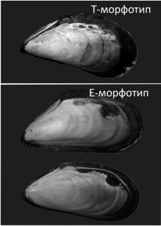

```{r setup, include=FALSE}
library(knitr)
library(dplyr)
library(readxl)
library(ggplot2)
library(ggvegan)
library(vegan)
library(cowplot)
library(ggvegan)
library(ggrepel)
library(mapproj)
data <- read_excel("D:/Rabota_2024/Data/Mussel_Bed_N_species_2023.xlsx")
data$D <- data$NT / (data$NT + data$NE)
opts_chunk$set(echo = TRUE, message= F, warning = F)
```

## Эколого-биологический центр “Крестовский остров”

## Лаборатория Экологии Морского Бентоса

## (гидробиологии)

&nbsp;

&nbsp;


&nbsp;

# И. Нужин 

###### К вопросу о влиянии таксономического состава поселения мидий на структуру сообщества мидиевой банки 

&nbsp; 

&nbsp; 

&nbsp;

## Санкт-Петербург    
## 2022

\pagebreak


# Введение

В Белом море двусторчатые моллюски рода *Mytilus* образуют плотные поселения, которые принято называть мидиевыми банками (Хайтов, 1999). Мидиевая банка создаёт среду, удобную для заселения многими другими бентосными организмами. Таким образом, возникает особое сообщество, изучение структуры которого уже долгое время представляет интерес для исследователей, что связано как с коммерческой ценностью мидий, так и с их огромной ролью в фауне Белого моря [@kulakovskiy1993; @khaitov1999].

До недавнего времени полагали, что в Белом море обитает только один вид мидий - *Mytilus edulis* [@naumov2006]. Однако молекулярно-генетические исследования позволили выяснить, что помимо коренного вида Белое море населено мидиями вида *Mytilus trossulus* [@katolikova2016]. Предполагается, что *M. trossulus* был занесён европейские моря во время Второй Мировой войны судами, шедшими с Атлантического побережья Северной Америки [@strelkov2012]. Несмотря на морфологическое сходство между мидиями разных видов наблюдается ряд физиологических и экологических различий. Например, показаны различия в количестве образуемых мидиями разных видов биссусных нитей [@shalagaeva2018; @ershova2022]. Также известно, что мидии разных видов в разной степени восприимчивы к седиментации [@voronova2016]. Установлено, что хищники, такие как *Asterias rubens*, с большей вероятностью атакуют *M. trossulus*, чем *M. edulis* [@makarycheva2017]. Подобные различия заставляют предположить, что таксономический состав поселения мидий как вида-эдификатора оказывает огромное влияние на сообщество мидиевой банки. Оценка этого влияния была выполнена в нашей предыдущей работе [@nuzhin2022]. Нами показано, что, во-первых, наблюдается отрицательная корреляция между  долей M. trossulus в обшей численности мидий и обилием других видов моллюсков. Во-вторых, доля *M. trossulus* в сообществе положительно коррелирует с обилием вида-оппортуниста *Polydora quadrilobata*.

Материал для нашей предыдущей работы был собран на мидиевых банках Лувеньгского архипелага. Возникает вопрос, являются ли выявленные нами зависимости характерными для всех мидиевых банок Белого моря или наблюдаются только в Лувеньгском архипелаге. 

Таким образом, целью нашей работы является анализ связи структуры сообщества мидиевых банок с таксономической структурой смешанного поселения вида-эдификатора. В рамках данной цели поставлены и решены следующие задачи:

1) Обнаружение различий между таксономическими структурами сообществ банок, расположенных в разных частях Кандалакшского залива Белого моря

2) Выявление видов, тяготеющих к сообществам с большой долей вида-вселенца *M. trossulus*, и видов, антагонистичных к *M. trossulus*.

# Материалы и методика

## Точки сбора материала

В нашей работе использовались как данные, собранные Беломорскими
экспедициями ЛЭМБ в период с 2010 по 2016 год, исключая 2011 год, так и
данные, собранные летом 2023 года. В 2010-2016 годах сбор материала
производился на двух мидиевых банках, расположенных в Лувеньгском
архипелаге Кандалакшского залива Белого моря (банки "Мat" и "Korg", на
карте обозначены красным, рис. 1); в 2023 году сбор материала производился на
мидиевых банках в Вороньей губе Белого моря (банки "Vor3" и "Vor4", на
карте обозначены синим, рис. 1)

```{r, fig.cap = "Рисунок 1. Расположение исследуемых мидиевых банок", echo = FALSE, message=FALSE}
Kand_upper_x <- c(32.2, 33.06)
Kand_upper_y <- c(66.9, 67.16)

ggKand_upper <- read.csv("D:/Rabota_2024/Data/ggKand_upper.csv")

banks <- data.frame(long = c(32.642790, 32.642897, 32.478542, 32.506852), lat = c(67.110668, 67.113299, 66.938023, 66.934386), Name = c("Korg", "Mat", "Vor3", "Vor4"))

Plot_Kand_upper <-
ggplot(ggKand_upper, aes(x=long, y=lat, group=group)) +
geom_polygon(fill = "gray70", colour = "black") +
coord_map(xlim = Kand_upper_x, ylim = Kand_upper_y) +
theme(axis.ticks=element_blank(), axis.title.x =element_blank(), axis.title.y= element_blank(), plot.background = element_rect(fill = NULL), panel.grid = element_blank()) +
annotate (x= 32.410973, y = 67.154371, geom = "point", size = 5, shape = 21, color = "black", fill = "white") +
annotate (x= 32.52, y = 67.154371, geom = "text", label = "Кандалакша")+
geom_point(data = banks, aes(color = Name, group = 1), size = 3) +
scale_color_manual(values = c("red", "red", "blue", "blue")) +
geom_text_repel(data = banks, aes(label = Name, group = 1)) +
guides(color = "none")

Plot_Kand_upper

```

## Методика сбора и обработка материала

Методы взятия проб грунта подробно описана в работе В.М.Хайтова
[@khaitov2013].Кратко суть методики сводится ка следующему. Шесть
случайно расположенных проб были отобраны с каждой банки с 1 по 15
августа каждого года. Отбор проб мы производили круглым керном площадью
55 $см^2$. Пробоотборник бросали на мидиевую барку случайным образом.
Если случайно брошенный керн попадал на участок, свободный от мидий,
отбор проб проводился на ближайшем участке с мидиями. Керн вдавливался в
грунт на глубину около 10 см. Затем содержимое помещалось в пластиковый
пакет и доставлялось в лабораторию. Пробы промывались через сито с
размером ячеи 0,5 мм. Все макробентосные животные и растения были
выбраны из проб и идентифицированы до минимально возможного
таксономического уровня, подсчитаны и взвешены с точностью до 0,001 г.
Обилие живых и обилие мёртвых особе мы считали отдельно. Различные виды
нитчатых водорослей не разделялись, а высушивались совместно на
фильтровальной бумаге и взвешивались с точностью до 0,001 г.

## Определение морфотипов мидий

*М.edulis* и *M.trossulus* являются криптическими видами,
т.е.практически неразличимы по морфологическим признакам [@katolikova2016]. Однако, некоторые различия всё же обнаружены. Например,
вместо трудоёмкого определения видов можно использовать так называемые
морфотипы [@khaitov2021]. Выделяется два морфотипа: Т-морфотип,
представители которого с большой вероятностью явяются представителями
вида *M. trossulus*, и Е-морфотип, представители которого с большой
вероятностью являются представителями вида *M. edulis*. Подробно
методика морфотипизации описана в нашей предыдущей работе [@nuzhin2022].
Для определения морфотипов в каждой пробе были отобраны моллюски с
длиной раковины более 10 мм. Эти моллюски были сварены, после чего у них
удалили мягкие ткани. На сухих створках мы анализировали паттерн
закладки перламутра на внутренней поверхности раковин. Мидии, у которых
слой перламутра в районе лигамента вплотную подходил к нимфе, мы
относили к Е-морфотипу; остальные моллюски, у которых между нимфой
лигамента и перламутровым слоем просматривалась полоска призматического
слоя, относились к Т-морфотипу. На рисунке 2 изображены типичные представители обоих морфотипов



Рисунок 2. Внешний вид раковин мидий двух морфотипов.


В каждой пробе было определено
соотношение численности мидий T-морфотипа к общему количеству крупных
(длиной не меньше 10 мм) мидий, которое почти полностью совпадает с
отношением количества *M.trossulus* к общей численности [@khaitov2021]. Это соотношение выражалось как доля особей с T-морфотипом в общем
количестве особей. Обозначим эту величину как $D = \frac{N_t}{N_t+N_e}$. Пробы, для которых $D > 0.5$, мы далее обозначали, как "T-dominated" (то есть микробиотопы, связанные с поселением мидий, в котором преобладают *M.trossulus*); пробы, для которых $D < 0.5$ - "Е-dominated" (в поселении мидий преобладают *M. edulis*). 

## Статистическая обработка

Была получена матрица обилия видов в пробах. Для всех видов животных
показателем обилия считалась численность, для водорослей - биомасса. Все
показатели были логарифмированы.

Для оценки влияния таксономической структуры поселения мидий на
сообщество мидиевой банки использовался анализ избыточности [@vegan]. Этот метод применяется для анализа связи многомерного массива данных (в нашем случае матрица обилий видов сообщества) с набором предикторов. Такую связь невозможно отразить на плоском графике, в связи с чем применяются технологии снижения размерности с последующей ординацией.  Суть метода анализа избыточности (RDA) состоит в следующем. Для каждой переменной в исходной матрице (логарифмы показателей обилия) была построена регрессионная модель, описывающая связь обилия с двумя предикторами: 

1. Доля мидий Т-морфотипа в пробе (непрерывный предиктор, $D$);

2. Мидиевая банка  (дискретный предиктор с четырьмя градациями: Vor3, Vor4, Korg, Mat).

Далее, для каждого вида в каждой из проб было получено значение, предсказанное регрессионной моделью. Полученная матрица далее подвергалась снижению размерности с помощью анализа главных компонент. Суть метода главных компонент заключается в том, что каждой пробе сопоставляется точка в n-мерной системе координат, где по осям отложены предсказанные регрессионной моделью значения (обилие *Mytilus* spp. было исключено из матрицы). Далее, через полученное облако точек проводятся две новых перпендикулярных оси так, чтобы дисперсия значений по этим осям была бы максимальной. Эти две оси (главные компоненты) задают новую систему координат, в которых можно построить ординацию проб или видов. Далее, все точки проецируются на плоскость, задаваемую полученными новыми осями. При этом, все точки, которые связаны с тем или иным предиктором  будут группироваться рядом друг с другом: положительно связанные с предиктором в одном участке ординации, а отрицательно коррелирующие с ним - в другой части. Те точки, которые не находятся под влиянием предикторов, включенных в регрессионную модель, будут концентрироваться в районе нулевых значений новых координат. Метод RDA позволяет также в новой системе координат отразить расположение центроидов, соответствующих градациям дискретного фактора (*Банка*), и выявить направление, соответствующее положительной корреляции с непрерывным предиктором ($D$). 


<!-- Анализ избыточности был проделан для общей матрицы обилий, а также -->
<!-- отдельно для матрицы облилий мёртвых моллюсков. -->

Оценка статистической
значимости всей модели в целом и значимости влияния отдельных
предикторов осуществлялось с помощью пермутационной процедуры [@bates1992]. 

Все анализы и визуализация их результатов были проведены с использованием функций языка
статистического программирования R [@R] из пакетов 
"vegan" [@vegan] и "ggplot2" [@ggplot2].

# Изложение результатов

В таблицах 1 и 2 приведены результаты оценки значимости модели,
построенной для матрицы облилий живых организмов (таблица 1), и
значимости влияния предикторов, используемых в этой модели (таблица 2). Так как во
всех случаях величина $Pr = 0.001$, модель и предикторы являются статистически
значимыми.

```{r, echo=FALSE, message=FALSE}
exclude <- c("Year", "N", "B", "Bank", "Season", "Sample", "NT", "NE", "D", "Arenicola_marina", "Bunodactis_stella", "Cylichna_occulta_DEAD", "Harmothoe_imbricata", "Pectinaria_hyperborea", "Fucus_sp.", "Skeneopsis_planorbis",  "Skeneopsis_planorbis_DEAD")
trup <- c("Cylichna_occulta_DEAD", "Hydrobia_ulvae_DEAD", "Littorina_sp._DEAD", "Macoma_balthica_DEAD", "Onoba_aculeus_DEAD", "Skeneopsis_planorbis_DEAD")

data <- data %>% filter(NT !=0 & NE !=0)

mat <- data %>% filter(NT !=0 & NE !=0) %>% select(-exclude) 

vor <- data %>% filter(Bank == "VOR4" & NT !=0 & NE !=0)

vor4 <- vor %>% select(-exclude) 

dead <- data %>% filter(NT !=0 & NE !=0) %>% select(trup)
vor4_dead <- data %>% filter(NT !=0 & NE !=0)%>% filter(Bank == "VOR4") %>% select(trup) 


mat_log <- decostand(mat, method = "log")
dead_log <- decostand(dead, method = "log")

vor4_log <- decostand(vor4, method = "log")
vor4_dead_log <- decostand(vor4_dead, method = "log")

mat_rda <- rda(mat_log ~   Bank + D , data = data)
d <- fortify(anova(mat_rda))

s <- summary(mat_rda)


m <- anova.cca(mat_rda, by = "margin")

kable(d, caption = "Таблица 1. Статистическая значимость модели")
kable(m, caption = "Таблица 2. Статистическая значимость предикторов")
```


```{r, echo=FALSE, message=FALSE, fig.cap="Рисунок 3. Ординация проб (A) и видов (B) в канонических осях, связанных с влиянием предикторов. Непрерывный предикиктор модели отражен стрелкой, центроиды, соответствующие дискретному фактору 'Банка', помечены названиями градаций фактора, виды пронумерованы в соответствии с таблицей 3"}

gg <- fortify(mat_rda)
predictors <- data %>% select(Bank)
sites <- gg %>% filter(score == "sites") %>% mutate(Bank = data$Bank)
centroids <- gg %>% filter(score == "centroids")
mat <- gg %>% filter(score == "centroids" & label == "Bankmat")
biplots <- gg %>% filter(score == "biplot" & label == "Bankmat")
D <- gg %>% filter(label == "D")
species <- gg %>%  filter(score == "species") %>% mutate(N = c(1:20))

Pl_sites <- 
ggplot(data = sites, aes(x = RDA1, y = RDA2)) + 
  geom_point(aes(color = Bank)) +
  scale_color_manual(values = c("black", "gray", "red", "blue"))+
  geom_text(data = centroids, aes(label = label), color = "darkgreen" ) +
  geom_hline(yintercept = 0, linetype = 2) +
  geom_vline(xintercept = 0, linetype = 2) +
  theme_bw() +
  geom_segment(data = D, aes(x = 0, y = 0, xend = 4 * RDA1, yend = 4 * RDA2), arrow = arrow(angle = 5), color = "darkgreen", show.legend = F) +
  theme(legend.position = "bottom") +
  geom_text(data = D, aes(x = 4 * RDA1, y = 4 * RDA2, label = "D"), color = "darkgreen" ) +
  ggtitle("A")


Pl_species <- 
ggplot(data = species, aes(x = RDA1, y = RDA2)) + 
  geom_point() +
  scale_color_manual(values = c("black", "gray", "red", "blue"))+
  geom_text_repel(data = centroids, aes(label = label), size = 4, color = "darkgreen" ) +
  geom_hline(yintercept = 0, linetype = 2) +
  geom_vline(xintercept = 0, linetype = 2) +
  geom_text_repel(aes(label = N)) +
  theme_bw() +
  geom_segment(data = D, aes(x = 0, y = 0, xend = 4 * RDA1, yend = 4 * RDA2), arrow = arrow(angle = 5), color = "darkgreen") +
  geom_text(data = D, aes(x = 4 * RDA1, y = 4 * RDA2, label = "D"), color = "darkgreen" ) +
  ggtitle("B")
plot_grid(Pl_sites, Pl_species, nrow = 2)


```

```{r, echo=F, message=FALSE}

species$label <- gsub(pattern = "_", replacement = " ", x = species$label)
species$label <- gsub(pattern = "DEAD", replacement = "мёртвые", x = species$label)
i <- data.frame(species$label, species$N)

row.names(i) <- NULL
colnames(i) <- NULL


kable(i, caption = "Таблица 3. Обозначения, принятые для видов встреченных организмов")


```


Дисперсия, объясняемая первой и второй каноническими осями, составляет `r round(s$cont$importance[2,1:2] * 100)`% от общей дисперсии.
Ординация проб в канонических осях, связанных с влиянием предикторов,
отражает различия между сообществами мидиевых банок Лувеньгского
архипелага и Вороньей губы. На рисунке 3 хорошо видны два облака
точек. Первое составляют пробы, взятые на банках Vor3 и Vor4, второе -
пробы, взятые на банках Mat и Korg, причём пробы из Вороньей губы
находятся в зоне больших отрицательных значений RDA1.

Дисперсия, объясняемая канонической осью RDA1, на порядок выше, чем дисперсия, объясняемая канонической осью RDA2. Пробы с банок Вороньей губы и Лувеньгского архипелага разведены по значениям RDA1, а величина $D$ (зелёная стрелка), характеризующая таксономическую структуру поселения мидий, обнаруживает связь с обеими каноническими осями. Следовательно, можно сказать, что различия между пробами объясняются в первую очередь географическим расположением мидиевых банок, и в меньшей степени таксономическим составом поселения мидий.

Из данных, приведённых на рисунке 3, видно, что большинство видов
сосредоточены в районе нулевых значений канонических осей, что говорит
об их индифферентности по отношению к влиянию предикторов. Однако
некоторые виды выбиваются из этой тенденции. Такие виды как *Polydora quadrilobata, Capitella capitata, Chironomidae gen.sp., Fabricia sabella, Macoma balthica* (16, 1, 2, 3, 10 соответственно) демонстрируют
выраженную положительную связь с величиной $D$,
располагаясь в области отрицательных значений RDA2. *Jaera sp.* (7) и
*Onoba aculeus* (14), напротив, обнаруживают отрицательную связь с
величиной $D$. Кроме того, некоторые мёртвые моллюски (*Hydrobia ulvae, Littorina sp., Macoma baltica*), а также бокоплавы (4), тяготеют к
банкам Вороньей губы, группируясь около соотвествующих центроидов.


```{r, echo=FALSE, message=FALSE, fig.cap="Рисунок 4. Обилие видов, чувствительных к изменению величины D, в пробах с разным доминирующим морфотипом"}
vor$D_l <- (vor$NT / (vor$NT + vor$NE) > 0.5)


p1 <- ggplot(data = vor, aes(x = D_l, y = log(Polydora_quadrilobata + 1))) + geom_boxplot() + theme_bw() + xlab("  ") + ylab("Обилие") + scale_x_discrete(labels = c("E dominated", "T dominated")) + ggtitle("Polydora quadrilobata")
p2 <- ggplot(data = vor, aes(x = D_l, y = log(Capitella_capitata + 1))) + geom_boxplot()+ theme_bw() + xlab("") + ylab("Обилие ") + scale_x_discrete(labels = c("E dominated", "T dominated")) + ggtitle("Capitella capitata")
p3 <- ggplot(data = vor, aes(x = D_l, y = log(Chironomidae_gen_sp + 1))) + geom_boxplot()+ theme_bw() + xlab("") + ylab("Обилие ") + scale_x_discrete(labels = c("E dominated", "T dominated")) + ggtitle("Chironomidae.gen.sp")
p4 <- ggplot(data = vor, aes(x = D_l, y = log(Fabricia_sabella + 1))) + geom_boxplot()+ theme_bw() + xlab("") + ylab("Обилие ") + scale_x_discrete(labels = c("E dominated", "T dominated")) + ggtitle("Fabricia sabella")
p5 <- ggplot(data = vor, aes(x = D_l, y = log(Hydrobia_ulvae_DEAD + 1))) + geom_boxplot()+ theme_bw() + xlab("") + ylab("Обилие") + scale_x_discrete(labels = c("E dominated", "T dominated")) + ggtitle("Мёртв. Hydrobia ulvae")
p6 <- ggplot(data = vor, aes(x = D_l, y = log(Macoma_balthica + 1))) + geom_boxplot()+ theme_bw() + xlab("") + ylab("Обилие ") + scale_x_discrete(labels = c("E dominated", "T dominated")) + ggtitle("Macoma baltica")
p7 <- ggplot(data = vor, aes(x = D_l, y = log(Macoma_balthica_DEAD + 1))) + geom_boxplot()+ theme_bw() + xlab("") + ylab("Обилие") + scale_x_discrete(labels = c("E dominated", "T dominated")) + ggtitle("Мёртв. Macoma baltica")
p8 <- ggplot(data = vor, aes(x = D_l, y = log(Onoba_aculeus_DEAD + 1))) + geom_boxplot()+ theme_bw() + xlab("") + ylab("Обилие") + scale_x_discrete(labels = c("E dominated", "T dominated")) + ggtitle("Мёртв. Onoba aculeus")
p9 <- ggplot(data = vor, aes(x = D_l, y = log(Littorina_sp._DEAD + 1))) + geom_boxplot()+ theme_bw() + xlab("") + ylab("Обилие") + scale_x_discrete(labels = c("E dominated", "T dominated")) + ggtitle("Мёртв. Littorina sp.")
p10 <- ggplot(data = vor, aes(x = D_l, y = log(Нитчатые_водоросли + 1))) + geom_boxplot()+ theme_bw() + ylab("Обилие") + xlab("") + ggtitle("Нитчатые водоросли") + scale_x_discrete(labels = c("E dominated", "T dominated"))

plot_grid(p1, p2, p3, p7, p10) 

```

```{r, echo=FALSE, message=FALSE, fig.cap="Рисунок 5. Обилие видов, индифферентных к изменению величины D, в пробах с разным доминирующим морфотипом"}
plot_grid(p5, p6, p4, p8, p9)

```


На рисунках 4 и 5 показано обилие видов, населяющих мидиевую банку Vor4 в 2023 году и проявивших по результатм предыдущего анализа положительную связь с предиктором D. Виды первой группы (рисунок 4), в которую попадают *Polydora quadrilobata, Capitella capitata, Chironomidae* и нитчатые
водоросли, а также мёртвые *Macoma baltica*, имеют  более высокие обилия в  пробах T-dominated, чем в пробах Е-dominated. Вторая группа видов (рисунок 5), в которую попадают мёртвые *Onoba aculeus, Littorina sp., Hydrobia ulvae*, а также *Macoma balcica * и *Fabricia sabella*, на банке Vor4 имеет примерно равные обилия в пробах Е-dominated и Т-dominated.


# Обсуждение результатов

Нами было показано, что между таксономическим составом поселения мидий и составом сообщества мидиевой банки, ассоциированным с этим поселением, существует связь. Однако, мы выяснили, что сила влияния этого фактора значительно ниже, чем влияние факторов, связанных с географической разобщенностью сообществ. 

В сообществах, где велика доля мидий Т-морфотипа, с одной стороны, встречается малое количество других моллюсков, а с другой стороны, велико обилие полихет-трубкостроителей и нитчатых водорослей. По всей видимости, данные эффекты объясняются имеющимися между мидиями разных видов физиологическими различиями.

Одним из основных физиологических различий между двумя видами мидий
являются количество и жёсткость образуемого ими биссуса. Показано, что мидии Т-морфотипа образуют больше биссуса,
чем мидии Е-морфотипа, и сила прикрепления у первых значимо выше  [@shalagaeva2018; @ershova2022; @kirillov2018]. Это позволяет объяснить большинство полученных нами результатов. В частности, нами показано, что двустворчатые и брюхоногие моллюски
(*Onoba aculeus, Sceneopsis planorbis, Macoma baltica*) будут с большей
вероятностью встречены мёртвыми в пробах с доминирующим Т-морфотипом.
Показано, что большое количество биссуса отрицательно влияет на
жизнедеятельность улиток [@khaitov1999; @britikov2022], так как биссус лишает их возможности двигаться.
Можно предположить, что данная закономерность будет верна и для других
улиток. В случае двустворок *Macoma baltica* отрицательное влияние мидий T-морфотипа можно объяснить тем, что биссус, вырабатываемый мидиями не дает створкам моллюска в полной мере раскрываться.

Биссус, также, может удерживать на банке нитчатые водоросли [@khaitov2008], что объясняет их тяготение к
пробам с большой долей мидий Т-морфотипа. Большое количество нитчатых
водорослей создаёт условия для оседания на банку личинок хирономид [@salovius2004], позволяя, в свою очередь, объяснить их положительную связь с высоким обилием мидий Т-морфотипа.

Виды-оппортунисты, такие как 
Полихеты *Polydora quadrilobata, Capitella capitata* и *Fabricia sabella*, тяготеют к пробам с большой
долей мидий Т-морфотипа. Эти виды известны, как виды-оппортунисты [@khaitov1999], то есть организмы, которые дают вспышки численности в тех биотопах, где произошло нарушение предыдущего сообщества. В частности показано, что *Polydora quadrilobata* и *Capitella capitata* увеличивают численность в биотопах, связанных с отмершими мидиями [@khaitov1999]. Следовательно, можно предположить, что мидии Т-морфотипа более обильны на тех участках мидиевой банки, где недавно произошло вымирание. Если это так, то не исключено, что на месте вымерших поселений *M. edulis* возникают поселения *M. trossulus*.

Таким образом, мидиевые банки имеют мозаичную структуру. Можно выделить участки на которых обильны мидии разных морфотипов. Сообщество донных беспозвоночных реагирует на таксономический состав поселения вида-эдификатора.


## Выводы

1) Закономерности, выявленные нами для мидиевых банок Лувеньгского архипелага, характерны и для сообществ Вороньей губы

2) Избыток в поселении *M. trossulus* ведет к гибели других видов моллюсков и увеличению численности нитчатых водорослей, с которыми, свою очередь, связаны  личинки хирономид.

3) Высокая концентрация *M. trossulus* приурочена к местам, где велико обилие видов-оппортунистов, характерных для мест, где недавно произошло разрушение сообщества. 

# Благодарности

Автор считает своим долгом выразить благодарность всем участникам XLV-LVII Беломорских экспедиций Лаборатории Экологии Морского Бентоса за помощь в сборе и обработке материала, а также Кандалакшскому государственному природному заповеднику за предоставленные возможности для проведения исследований.

Огромную благодарность автор желает выразить своему научному руководителю Вадиму Михайловичу Хайтову, без участия которого даннная работа не была бы написана.

# Список литературы

<!-- Бритиков А. (2022) Влияние мидий на жизнедеятельность литоральных брюхоногих моллюсков за счет прикрепления к ним биссусных нитей.  Работа депонирована в библиотеке Лаборатории Экологии Морского Бентоса. -->

<!-- Воронова Т. (2016). Влияние осадконакопления на смертность беломорских мидий. Работа депонирована в библиотеке Лаборатории Экологии Морского Бентоса. -->

<!-- 3) Ершова Т. (2022) Защитные реакции беломорских *Mytilus edulis* и *M. trossulus* в ответ на сигналы от *Asterias rubens*. Работа депонирована в библиотеке Лаборатории Экологии Морского Бентоса. -->

<!-- 4) Кулаковский Э.Е., Сухотин А.А., Халаман В.В.(1993) Формирование поселений беломорских мидий в условиях марикультуры в разных районах губы Чупа (Кандалакшский залив) // Исследования по марикультуре мидий на Белом море.-Санкт-Петербург.-1993.-с.24-41. -->

<!-- 5) Макарычева А. (2017) Гидробиологические исследования в Кандалакшском заповеднике. За 2017 г. Ежегодные отчеты, депонированные в библиотеке Кандалакшского государственного заповедника. Лаборатория экологии морского бетоса (гидробиологии) -->

<!-- 6) Наумов А. Д. Двустворчатые моллюски Белого моря. Опыт эколого-фаунистического анализа. – 2006. -->

<!-- 7) Нужин И. (2022) Влияние таксономического состава смешанных поселений *Mytilus edulis* Linnaeus, 1758 и *M. trossulus* Gould, 1850 на структуру сообществ мидиевых банок. Работа депонирована в библиотеке Лаборатории Экологии Морского Бентоса. -->

<!-- 8) Стрелков, П. П., В. М. Хайтов, and М. В. Католикова. "Голубые ракушки." Природа 6 (2012): 51-56. -->

<!-- 9) Хайтов, Вадим Михайлович. "Сообщества донных беспозвоночных, связанные с естественными плотными поселениями мидий на мелководьях Белого моря (структура, динамика, биотические взаимоотношения)." (1999). -->

<!-- 10) Халаман В.В., Кулаковский Э.Е.(1993) Формирование сообщества макрообрастания на искусственных субстратах в условиях мидиевой культуры на Белом море // Исследования по марикультуре мидий на Белом море.-Санкт-Петербург.-1993.-с.83-100. -->

<!-- 11) Шалагаева М. (2018). Биссусные прикрепления *Mytilus edulis* Linnaeus, 1758 и *M. trossulus* Gould, 1850: механизм подавления конкурента? Работа депонирована в библиотеке Лаборатории Экологии Морского Бентоса. -->

<!-- 12) Chambers, J. M. and Hastie, T. J. (1992) Statistical Models in S, Wadsworth & Brooks/Cole. -->

<!-- 13) Katolikova M, Khaitov V, Väinölä R et al (2016) Genetic, ecological and morphological distinctness of the blue mussels mytilus trossulus gould and m. Edulis l. In the white sea. PLoSOne11:e0152963 -->

<!-- 14) Khaitov, Vadim. (2012). Life in an unstable house: Community dynamics in changing mussel beds. Hydrobiologia. 706. 10.1007/s10750-012-1283-x. -->

<!-- 15) Khaitov, Vadim & Marchenko, Julia & Katolikova, Marina & Väinölä, Risto & Kingston, Sarah & Carlon, David & Gantsevich, Mikhail & Strelkov, Petr. (2021). Species identification based on a semi-diagnostic marker: Evaluation of a simple conchological test for distinguishing blue mussels Mytilus edulis L. and M. trossulus Gould. PLOS ONE. 16. e0249587. 10.1371/journal.pone.0249587. -->

<!-- 16) Salovius, Sonja, and Patrik Kraufvelin. "The filamentous green alga *Cladophora glomerata* as a habitat for littoral macro-fauna in the northern Baltic Sea." Ophelia 58.2 (2004): 65-78. -->

<!-- 17) Oksanen J, Simpson G, Blanchet F, Kindt R, Legendre P, Minchin P, O'Hara R, Solymos P, Stevens M, -->
<!--   Szoecs E, Wagner H, Barbour M, Bedward M, Bolker B, Borcard D, Carvalho G, Chirico M, De Caceres -->
<!--   M, Durand S, Evangelista H, FitzJohn R, Friendly M, Furneaux B, Hannigan G, Hill M, Lahti L, -->
<!--   McGlinn D, Ouellette M, Ribeiro Cunha E, Smith T, Stier A, Ter Braak C, Weedon J (2022). _vegan: -->
<!--   Community Ecology Package_. R package version 2.6-4, <https://CRAN.R-project.org/package=vegan>. -->

<!-- 18) R Core Team (2023). _R: A Language and Environment for Statistical Computing_. R Foundation for Statistical Computing, Vienna, Austria. <https://www.R-project.org/>. -->

<!-- 19) H. Wickham. ggplot2: Elegant Graphics for Data Analysis. Springer-Verlag New York, 2016. -->


